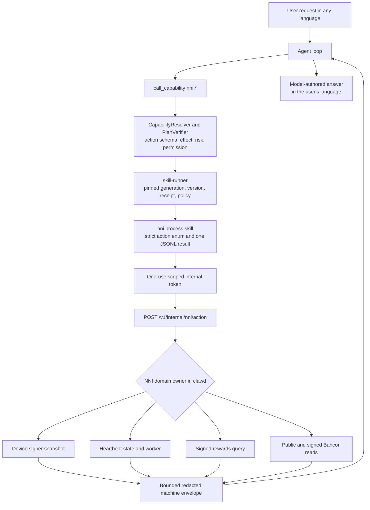

# NNI Capability and Heartbeat Control

<!-- ai-learning-stage: capabilities-artifacts -->
<!-- ai-learning-audience: operator,developer -->

<!-- ai-learning-navigation:start -->
Previous: [Browser media discovery](12-media-discovery.md) |
[Architecture index](README.md)
<!-- ai-learning-navigation:end -->

The fixed `nni` skill lets the agent inspect NNI state, control heartbeat participation, read
device rewards and Bancor data, and preview a Bancor quote. The skill is always available for
queries, while heartbeat participation remains an independent user-controlled runtime state.

Ordinary requests in any language enter the agent loop. The model selects a registered `nni.*`
capability from semantic metadata; runtime code never matches localized phrases to select an NNI
action or render the final answer.

## Current Flow

The skill process does not read NNI state files, run the hardware signing helper, inherit provider
or administrator credentials, or call remote nodes directly. `clawd` owns those operations and
returns only bounded structured observations.

## Node Selection and Remote API

The UI stores a directory of bound node endpoints plus one explicit active node. Heartbeat,
rewards, Bancor UI routes, and agent-invoked `nni.*` capabilities all use that same active node for
the complete request. They do not silently fail over to another bound node because account,
market, authorization, and signature context must not be mixed across nodes.

Browsers and skills never call a node directly. They use the local versioned API, while one
central remote-API boundary in `clawd` constructs `/v1/nni/server/*` endpoints and owns the bounded
network timeout. This leaves the node directory independent from business routes: future signed
directories, peer discovery, or decentralized node registries may populate bound-node candidates
without changing NNI/Bancor contracts. Changing the active node remains an explicit user or policy
decision.
An active runtime must be stopped before its selected node can change, keeping heartbeat and
authorization state tied to one node for the entire participation session.

## Available Actions

| Area | Actions | Behavior |
| --- | --- | --- |
| State | `status`, `device_status`, `heartbeat_status` | Read local signer and heartbeat machine fields. |
| Heartbeat | `heartbeat_enable`, `heartbeat_disable`, `heartbeat_now` | Change or diagnose heartbeat participation under the shared operation lock. |
| Rewards | `network_stats`, `my_rewards` | Read public aggregate network statistics without a signer, or use a device signature for private per-device reward history. |
| Bancor | `bancor_market`, `bancor_market_trades`, `bancor_candles` | Read bounded public market data. |
| Private Bancor | `bancor_account` | Read the signed device account and recent device trades. |
| Quote | `bancor_quote` | Preview expected output and protection fields without signing or executing a trade. |

`bancor_account` is self-contained: it checks signer availability and remote authorization and
returns both balances and the current signer's bounded recent trades. The planner does not call
`device_status` as a preflight and does not mix public `bancor_market_trades` into an account or
"my trades" answer. This keeps a private-query failure from being hidden by an unrelated successful
local or public observation.

No `buy`, `sell`, or `trade` capability exists in the skill registry. Remote-node configuration,
simulated signer enablement, administrator policy, and economic-model changes also remain outside
the natural-language NNI capability surface.

## Asset Authorization

The UI keeps asset ownership separate from hardware identity. One K1 asset public key may authorize
multiple hardware devices, while each hardware device has at most one active asset owner. Reward
eligibility, reward grants, and ledger source records remain per hardware device. When multiple
devices credit the same asset account, the server writes one grant and one immutable ledger entry
for each device instead of merging them; only the account balance is an aggregate projection.

Initial custom binding and rebinding require the current hardware signature plus a signature from
the target asset key. Rebinding does not require the previous asset private key, so a lost old key
does not permanently lock the device to an obsolete account. Unbinding requires only the current
hardware signature. Rebinding changes only that device's future reward destination; unbinding
revokes only that device and stops local heartbeat intent until it is bound again. Lost-device
recovery remains a separate flow: it authorizes a newly allowlisted device and intentionally
revokes the owner's old device
authorizations. The custom-public-key UI validates the full Base58 K1 envelope before submission
and never receives or stores the corresponding private key.

Hardware-only unbinding intentionally makes physical signer control a recovery boundary. A party
that controls the signer can unbind that device and redirect its future rewards to a new asset key
that party can prove, but cannot bind an unrelated third-party public key without that target key's
signature. Existing balances and other devices remain under their current asset authorization.

The visual console exposes NNI, APR, Bancor, and Assets pages only to an authenticated administrator.
The local `clawd` asset-transfer endpoint independently enforces the administrator role instead of
treating a hidden UI page as authorization. Public NNI node APIs and their cryptographic contracts
remain independent of console roles.

## Asset Transfer

The Assets page can transfer exact eight-decimal AIC or USD amounts to any valid K1 asset public
key. An optional memo is limited to 256 UTF-8 bytes. The browser validates the full K1 envelope,
prevents self-transfer and overspending, and shows the complete sender, recipient, asset, amount,
memo, and signing method before confirmation. The user may authorize with the currently bound
hardware signer or enter the matching asset private key for one in-memory signature; the private
key is never persisted.

`clawd` creates one UUID idempotency key for each user submission and reuses it across candidate Edges.
Core persistently binds that key to a canonical request digest: an identical request receives the original
challenge, while different content under the same key is rejected. Before signing the short-lived v2
payload, `clawd` verifies its exact field set, account bindings, amount units, memo, nonce, expiry, request
key, and SHA-256 digest. If verification has an unknown network or `5xx` outcome, the same signature is
retried once against the same node; it is never submitted to a different node.

NNI Core commits the sender debit, recipient credit, two immutable ledger entries, immutable memo-bearing
transfer record, one-time task consumption, and public Explorer flow in one transaction. Replaying the
exact accepted signature only returns the stored result and cannot mutate balances again; another signature
or a rejected task cannot be reused. After signature verification and before balance mutation, Core applies
an atomic sender-account rate policy, while Edge and Core also shed abusive traffic by source IP and business
class. Database unique indexes and triggers reject duplicate request keys, duplicate nonces, self-transfer,
and mutation of intent identity fields. The recipient key does not need an existing device binding. The
public asset explorer remains read-only but immediately shows the `asset_transfer` transaction and memo in
both address histories.

Asset transfer is intentionally not an `nni.*` natural-language mutation capability. This keeps a
financial write behind the administrator UI's explicit review and signing flow while the agent can
continue to query structured account and market data.

## Device Contract

The runtime keeps separate facts instead of overloading one chip boolean:

- `signer_kind`: `hardware`, `simulated`, or `unavailable`
- `hardware_chip_present`: true only for a detected physical signer
- `signer_available`: true for a physical signer or a simulation the user enabled explicitly
- `simulation_enabled`: the user explicitly enabled simulation and it is the active signer
- `simulation_enable_available`: no signer is active, but simulation can be enabled through the separate UI action
- `local_participation_eligible`: whether local signed operations can be attempted
- `network_authorization`: `unknown`, `authorized`, or `rejected` according to remote evidence

Simulation is never enabled automatically. A simulated signer can be locally eligible, but it does
not bypass server-side public-key authorization. Full public keys, signatures, challenges, helper
paths, node URLs, and internal tokens are removed or reduced to safe previews before model access.

All physical-chip operations pass through one asynchronous serial gate, and queue time is not
charged against the helper execution timeout. `APP_NNI_SIGNATURE_HELPER_TIMEOUT_SECONDS` controls
that timeout; it defaults to 25 seconds and is bounded to 5-120 seconds. The UI does not promise a
fixed detection duration. A verified immutable hardware public key may be cached for one heartbeat
window, and page reads plus NNI capabilities reuse that evidence first. A helper timeout or an
overloaded device yields `detection_unavailable`, never `signature_chip_missing`; the UI reports a
missing chip only after a completed helper check explicitly reports that result.

## Heartbeat State

`heartbeat_enable` first verifies a signer and the active node, records the desired state, and
immediately attempts one heartbeat. A success becomes `active`. A temporary network failure keeps
the desired state and becomes `waiting_network`, allowing the existing worker to retry. An explicit
authorization rejection rolls the desired state back and becomes `rejected`.

`heartbeat_disable` is idempotent and coordinates with an in-flight heartbeat through the same
asynchronous lock. It stops future attempts without deleting history. Persisted status separates
`last_attempt_at_ts`, `last_success_at_ts`, `last_error_code`, consecutive failures, the last
successful node host, and the next expected heartbeat time. Runtime decisions never derive these
fields by parsing error prose.

## Process and Security Contract

- The runner grants the internal NNI endpoint from registered `nni.*` capabilities, not from a
  hardcoded skill-name dispatch branch.
- The internal endpoint accepts a one-use token bound to task, user, chat, channel, and `skill_name`.
- Input uses a closed action enum, bounded list sizes, fixed candle intervals, and decimal strings
  for assets.
- Output uses `extra.{schema_version,source_skill,status,action}` plus either `data` or canonical
  `error_code/message_key/retryable/details` fields.
- Machine timestamps ending in `_ts` or `_unix` receive a deterministic RFC 3339 `_utc` companion
  before model access. Answers use that companion instead of asking the model to calculate dates.
- Failures also carry `failure_phase`, `side_effect_applied`, and `recovery_action`. Explicit remote
  authorization rejection becomes `nni_device_not_authorized` with no side effect; an ambiguous
  mutating transport failure remains uncertain and requires reconciliation before retry.
- Registry and tests contain no live Bancor mutation action, and the child process receives no
  signing key or signing-helper execution authority.

Linux and macOS use the same no-chip and simulated contracts. Physical signer validation belongs
to supported hardware hosts such as the Raspberry Pi; desktop tests do not claim a physical chip.
