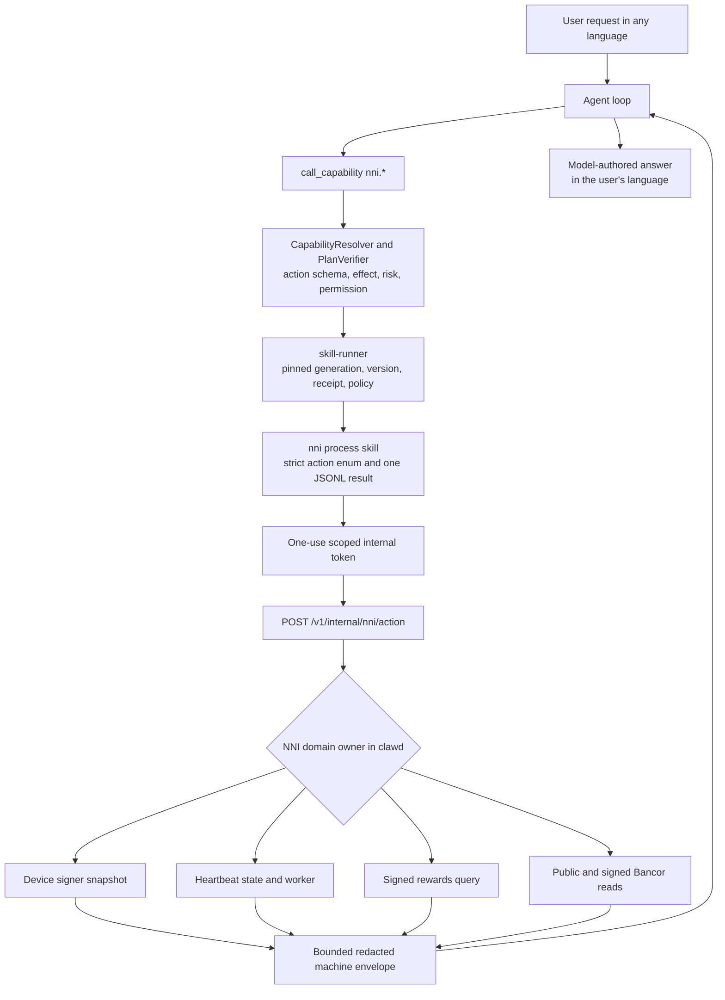

# NNI Capability and Heartbeat Control

<!-- ai-learning-stage: capabilities-artifacts -->
<!-- ai-learning-audience: operator,developer -->

<!-- ai-learning-navigation:start -->
Previous: [Browser media discovery](12-media-discovery.md) |
[Architecture index](README.md)
<!-- ai-learning-navigation:end -->

The fixed `nni` skill lets the agent inspect NNI state, control heartbeat participation, read
device rewards and Bancor data, and preview a Bancor quote. The skill is always available for
queries, while heartbeat participation remains an independent user-controlled runtime state.

Ordinary requests in any language enter the agent loop. The model selects a registered `nni.*`
capability from semantic metadata; runtime code never matches localized phrases to select an NNI
action or render the final answer.

## Current Flow

The skill process does not read NNI state files, run the hardware signing helper, inherit provider
or administrator credentials, or call remote nodes directly. `clawd` owns those operations and
returns only bounded structured observations.

## Available Actions

| Area | Actions | Behavior |
| --- | --- | --- |
| State | `status`, `device_status`, `heartbeat_status` | Read local signer and heartbeat machine fields. |
| Heartbeat | `heartbeat_enable`, `heartbeat_disable`, `heartbeat_now` | Change or diagnose heartbeat participation under the shared operation lock. |
| Rewards | `network_stats`, `my_rewards` | Use the device-signed reward query. Current server statistics are delivered with this signed response, so a signer is required. |
| Bancor | `bancor_market`, `bancor_market_trades`, `bancor_candles` | Read bounded public market data. |
| Private Bancor | `bancor_account` | Read the signed device account and recent device trades. |
| Quote | `bancor_quote` | Preview expected output and protection fields without signing or executing a trade. |

`bancor_account` is self-contained: it checks signer availability and remote authorization and
returns both balances and the current signer's bounded recent trades. The planner does not call
`device_status` as a preflight and does not mix public `bancor_market_trades` into an account or
"my trades" answer. This keeps a private-query failure from being hidden by an unrelated successful
local or public observation.

No `buy`, `sell`, or `trade` capability exists in the skill registry. Remote-node configuration,
simulated signer enablement, administrator policy, and economic-model changes also remain outside
the natural-language NNI capability surface.

## Device Contract

The runtime keeps separate facts instead of overloading one chip boolean:

- `signer_kind`: `hardware`, `simulated`, or `unavailable`
- `hardware_chip_present`: true only for a detected physical signer
- `signer_available`: true for a physical signer or a simulation the user enabled explicitly
- `simulation_enabled`: the user explicitly enabled simulation and it is the active signer
- `simulation_enable_available`: no signer is active, but simulation can be enabled through the separate UI action
- `local_participation_eligible`: whether local signed operations can be attempted
- `network_authorization`: `unknown`, `authorized`, or `rejected` according to remote evidence

Simulation is never enabled automatically. A simulated signer can be locally eligible, but it does
not bypass server-side public-key authorization. Full public keys, signatures, challenges, helper
paths, node URLs, and internal tokens are removed or reduced to safe previews before model access.

## Heartbeat State

`heartbeat_enable` first verifies a signer and configured nodes, records the desired state, and
immediately attempts one heartbeat. A success becomes `active`. A temporary network failure keeps
the desired state and becomes `waiting_network`, allowing the existing worker to retry. An explicit
authorization rejection rolls the desired state back and becomes `rejected`.

`heartbeat_disable` is idempotent and coordinates with an in-flight heartbeat through the same
asynchronous lock. It stops future attempts without deleting history. Persisted status separates
`last_attempt_at_ts`, `last_success_at_ts`, `last_error_code`, consecutive failures, the last
successful node host, and the next expected heartbeat time. Runtime decisions never derive these
fields by parsing error prose.

## Process and Security Contract

- The runner grants the internal NNI endpoint from registered `nni.*` capabilities, not from a
  hardcoded skill-name dispatch branch.
- The internal endpoint accepts a one-use token bound to task, user, chat, channel, and `skill_name`.
- Input uses a closed action enum, bounded list sizes, fixed candle intervals, and decimal strings
  for assets.
- Output uses `extra.{schema_version,source_skill,status,action}` plus either `data` or canonical
  `error_code/message_key/retryable/details` fields.
- Machine timestamps ending in `_ts` or `_unix` receive a deterministic RFC 3339 `_utc` companion
  before model access. Answers use that companion instead of asking the model to calculate dates.
- Failures also carry `failure_phase`, `side_effect_applied`, and `recovery_action`. Explicit remote
  authorization rejection becomes `nni_device_not_authorized` with no side effect; an ambiguous
  mutating transport failure remains uncertain and requires reconciliation before retry.
- Registry and tests contain no live Bancor mutation action, and the child process receives no
  signing key or signing-helper execution authority.

Linux and macOS use the same no-chip and simulated contracts. Physical signer validation belongs
to supported hardware hosts such as the Raspberry Pi; desktop tests do not claim a physical chip.
