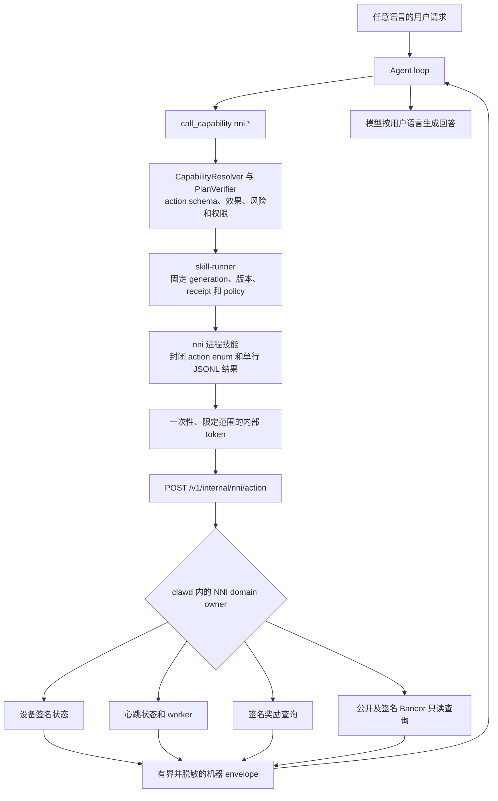

# NNI 能力与心跳控制

<!-- ai-learning-stage: capabilities-artifacts -->
<!-- ai-learning-audience: operator,developer -->

<!-- ai-learning-navigation:start -->
上一页：[浏览器媒体发现](12-media-discovery.zh-CN.md) |
[架构索引](README.md)
<!-- ai-learning-navigation:end -->

固定内置的 `nni` 技能允许 Agent 查询 NNI 状态、控制心跳参与、读取设备奖励和 Bancor
数据，并预览 Bancor 报价。技能始终可以用于查询，是否持续发送心跳则是独立、由用户控制的
运行状态。

任何语言的普通请求都进入 agent loop。模型根据语义元数据选择已经注册的 `nni.*`
capability；运行时代码不匹配某种语言的固定短语来选择 NNI action，也不写死最终回复。

## 当前流程

技能进程不读取 NNI 状态文件，不运行硬件签名 helper，不继承 provider/admin 凭据，也不直接
访问远端节点。这些操作由 `clawd` 负责，技能只接收有界的结构化观察结果。

## 可用动作

| 范围 | Actions | 当前行为 |
| --- | --- | --- |
| 状态 | `status`、`device_status`、`heartbeat_status` | 查询本机签名和心跳机器字段。 |
| 心跳 | `heartbeat_enable`、`heartbeat_disable`、`heartbeat_now` | 在共享操作锁下改变或诊断心跳参与状态。 |
| 奖励 | `network_stats`、`my_rewards` | 无需 signer 查询公开的全网汇总，或使用设备签名查询当前设备的私有奖励历史。 |
| Bancor | `bancor_market`、`bancor_market_trades`、`bancor_candles` | 查询有界的公开市场数据。 |
| 私有 Bancor | `bancor_account` | 查询签名设备账户和该设备最近的成交。 |
| 报价 | `bancor_quote` | 预览预计到账和保护字段，不签名、不成交。 |

`bancor_account` 是自包含查询：它自行检查 signer 和远端授权，并同时返回余额与当前 signer
有界的最近成交。planner 不把 `device_status` 当作前置探测，也不会把公开的
`bancor_market_trades` 混进账户或“我的成交”回答。这样，私有查询失败不会被无关的本地或
公开成功观察覆盖。

技能 registry 中没有 `buy`、`sell` 或 `trade` capability。远端节点配置、模拟签名开启、
管理员策略和经济模型修改也不属于自然语言 NNI 能力面。

## 资产授权

UI 把资产所有权与硬件身份分开管理。一个 K1 资产公钥可以授权多台硬件设备，但每台硬件设备
最多只有一个生效中的资产所有者。奖励资格、奖励 grant 和账本 source 记录始终按硬件设备
分别建立；多台设备把奖励计入同一个资产账户时，服务端仍逐设备写入 grant 和不可变账本记录，
不把多份奖励合成一笔，只有账户余额是这些记录的聚合投影。

首次绑定自定义公钥和更换绑定都需要当前硬件签名与目标资产密钥签名。更换不需要原资产私钥，
避免原私钥丢失后设备被永久锁定在旧账户上；解绑只需要当前硬件设备签名。更换只改变当前设备后续
奖励的归属；解绑只撤销当前设备，并停止本机心跳期望状态，重新绑定后才能继续。换机恢复仍是
独立流程：它授权一台已进入白名单的新设备，并有意撤销该资产账户的旧设备授权。自定义公钥在
UI 中先完成 Base58 K1 全合同校验，对应私钥不会进入或
保存在系统中。

硬件单签解绑意味着设备签名控制权属于恢复边界。控制 signer 的人可以解绑当前设备，并把该设备
未来的奖励改绑到其能够签名的新资产账户；但没有目标资产签名时，不能绑定无关第三方的公钥。
现有余额和同一资产账户下的其他设备授权不会因此改变。

可视化控制台只向已认证的管理员显示 NNI、APR、BANCOR 和资产页面，`clawd` 的本机资产转账
接口也会再次校验管理员身份，不能依赖前端隐藏页面充当授权。公开 NNI 节点 API 及其密码学合同
不依赖控制台角色。

## 资产转账

资产页面可以把精确到 8 位小数的 AIC 或 USD 转入任意合规 K1 资产公钥，并可附带最多 256
个 UTF-8 字节的 memo。浏览器先校验完整 K1 envelope，阻止向自己转账和超余额转账，并在
确认前完整展示付款账户、收款账户、资产、金额、memo 和签名方式。用户可以使用当前绑定的
硬件设备代签，也可以输入与付款账户匹配的资产私钥完成一次内存签名；私钥不会持久化。

`clawd` 为一次用户提交生成 UUID 幂等键，并在候选 Edge 间复用；Core 将该键与规范化请求摘要
持久绑定，相同请求只返回原 challenge，不同内容复用同一键会被拒绝。节点返回短时有效的 v2
转账载荷后，`clawd` 在签名前核对精确字段集合、账户绑定、最小单位金额、memo、nonce、过期
时间、请求键和 SHA-256 摘要。验证响应因网络或 `5xx` 无法确认时，只使用同一签名向同一节点
重试一次，不会切换节点重复成交。

NNI Core 在同一事务中完成付款方扣款、收款方入账、两条不可变账本、带 memo 的不可变转账
记录、一次性任务消费和公开 Explorer 流水。完全相同的已接受签名再次提交时只返回已落账结果，
不会再次变更余额；其他签名或已拒绝任务不能复用。Core 在签名验证后、余额变更前执行付款账户
频率限制，Edge/Core 另按来源 IP 和业务类别削峰。数据库唯一索引和触发器继续阻止重复请求键、
重复 nonce、自转和 intent 身份字段篡改。收款公钥不需要事先绑定设备；公开资产浏览器仍保持
只读，但会立即在双方地址历史中显示 `asset_transfer` 交易及其 memo。

资产转账不会暴露为 `nni.*` 自然语言变更 capability。金融写入继续经过管理员 UI 的显式复核
和签名流程，Agent 仍可以使用结构化 capability 查询账户和市场数据。

## 设备合同

运行时使用多个独立事实，不再让一个芯片布尔值承担全部语义：

- `signer_kind`：`hardware`、`simulated` 或 `unavailable`
- `hardware_chip_present`：只有检测到真实硬件 signer 时才为 true
- `signer_available`：真实 signer 或用户已经显式开启的模拟 signer 可用
- `simulation_enabled`：模拟 signer 已由用户显式开启并且当前正在作为签名来源
- `simulation_enable_available`：当前没有 signer，但可以通过独立 UI 操作显式开启模拟
- `local_participation_eligible`：本地是否具备尝试签名操作的条件
- `network_authorization`：根据远端证据记录 `unknown`、`authorized` 或 `rejected`

系统绝不会自动开启模拟签名。模拟 signer 可以在本地具备资格，但不能绕过服务端公钥准入。
完整公钥、签名、challenge、helper 路径、节点 URL 和内部 token 在进入模型前会被删除或缩减为
安全预览。

所有真实芯片操作经过同一个异步串行门禁，排队时间不计入 helper 自身的执行超时。helper 超时
由 `APP_NNI_SIGNATURE_HELPER_TIMEOUT_SECONDS` 配置，默认 25 秒，并限制在 5 至 120 秒；UI
不承诺固定检测时长。已验证的不可变硬件公钥可缓存一个心跳周期，页面读取和 NNI capability
优先复用该证据。检测进程超时或设备负载过高只会产生 `detection_unavailable`，不得推导成
`signature_chip_missing`；只有 helper 完成检测并明确报告不可用时，才显示缺少芯片。

## 心跳状态

`heartbeat_enable` 先验证 signer 和节点配置，再保存期望状态并立即尝试一次心跳。成功进入
`active`；临时网络故障保留期望状态并进入 `waiting_network`，由既有 worker 后续重试；明确的
授权拒绝会回滚期望状态并进入 `rejected`。

`heartbeat_disable` 是幂等操作，并通过同一个异步锁与在途心跳协调。它停止后续尝试，但不删除
历史。持久状态分别记录 `last_attempt_at_ts`、`last_success_at_ts`、`last_error_code`、连续失败
次数、最后成功节点 host 和下一次预期心跳时间。运行时不会解析错误文案来推导这些字段。

## 进程与安全合同

- runner 根据已经注册的 `nni.*` capability 授予内部 NNI 入口，不依赖技能名硬编码分发。
- 内部入口只接受绑定 task、user、chat、channel 和 `skill_name` 的一次性 token。
- 输入采用封闭 action enum、有界列表、固定 K 线周期和十进制金额字符串。
- 输出采用 `extra.{schema_version,source_skill,status,action}`，再携带 `data`，或规范的
  `error_code/message_key/retryable/details`。
- 以 `_ts` 或 `_unix` 结尾的机器时间字段在进入模型前获得确定性的 RFC 3339 `_utc` 配套
  字段；回答直接使用该字段，不让模型自行换算日期。
- 失败还携带 `failure_phase`、`side_effect_applied` 和 `recovery_action`。明确的远端授权拒绝
  统一为无副作用的 `nni_device_not_authorized`；变更动作遇到无法确认结果的传输错误时保留
  uncertain，并要求先核对结果再重试。
- registry 和测试不存在 Bancor 真实成交 action，子进程也拿不到签名密钥或签名 helper 执行权。

Linux 与 macOS 使用相同的无芯片和模拟合同。真实 signer 验收只在树莓派等支持的硬件主机上
执行，桌面测试不会伪造真实芯片结论。
