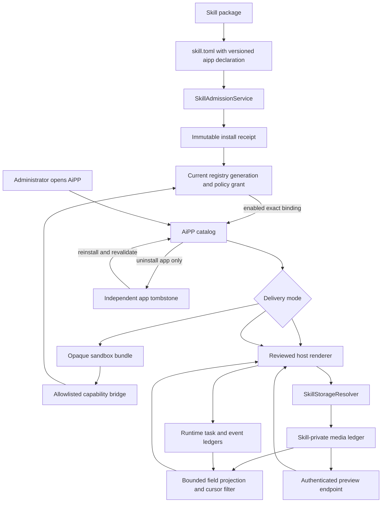

# AiPP Skill Companion Interfaces

<!-- ai-learning-stage: capabilities-artifacts -->
<!-- ai-learning-audience: operator,developer -->

<!-- ai-learning-navigation:start -->
Previous: [NNI capability and heartbeat control](13-nni-capability.md) |
Next: [AiAPP development guide](15-aipp-development-guide.md) |
[Architecture index](README.md)
<!-- ai-learning-navigation:end -->

AiPP gives an enabled skill a task-oriented visual companion for results that are
too rich or numerous for a chat stream. It does not replace Agent: users still ask
Agent to start, stop, or change work, while AiPP presents retained results.
`media_discovery` and `media_download` are the current host-rendered implementations.

## Current User Flow

The top-level UI entry is named AiAPP and appears for administrators. Its catalog contains only
enabled packages whose exact admitted manifest declares a supported `[aipp]`
contract. An independently removed app remains visible as a reinstallable
launcher while its skill stays enabled. The first view arranges those packages as application launchers; a
user selects one launcher before its task-oriented view opens. The browser
persists that selection in the neutral product storage namespace, so a refresh
returns to the same application. Media Discovery presents current collection
state, image and video records, author-provided post captions, capture-time
platform engagement counters, source links, filters, and stable cursor pagination.
Media Download presents only retained tasks that actually executed the media-download
skill, whether they entered through Agent UI or an external communication channel, and shows their
original requests and public source links, final model-processed text, failures,
and authenticated output artifacts. Video
covers are best-effort platform adapters: the collector uses an unobscured
rendered video frame or a platform-specific rendered poster and never
substitutes a page or login screenshot. Available covers are served from the
skill's private export directory through an authenticated preview endpoint.
Collected image screenshots use the same endpoint for preview and download.
Remote HTTPS image URLs are loaded without a referrer only as a fallback.

Clicking an image or a collected video cover opens a shared enlarged-image viewer,
not an immediate download. Its bottom-right download button uses the existing
authenticated collection-preview or task-artifact endpoint. The viewer fits the
desktop or mobile viewport, supports light and dark themes, retries failed image
loads/downloads, and closes through its close button, backdrop, or Escape. Text,
audio, and video artifact actions retain their own preview/download behavior.
This is reusable host presentation; it adds no skill-specific core route or
changes to the AiAPP installation contract.

Starting, pausing, resuming, and stopping collection remain Agent actions. This
keeps one natural-language capability path across the browser and communication
channels instead of adding a second control protocol to the UI.

## Admission and Read Flow



For an admitted package, the runtime verifies the current binding, package
version, manifest digest, install receipt digest, policy grant, enable state, and
registry generation before exposing it. A repository package without a runtime
binding is read from the base registry, subject to the same enable state.
Disabling, revoking, updating, or uninstalling a skill changes AiPP availability
with the same transaction. An operator may also uninstall only the Ai APP. This
writes an overlay tombstone without changing skill execution, configuration, or
private data. Reinstalling the app clears that tombstone only after the current
package has passed the same manifest, receipt, and generation checks.

## Security and Extension Boundary

AiPP has two host-rendered read contracts and one sandboxed extension mode.
`collection_feed_v1` reads a bounded skill-private collection ledger.
Its UI groups images by platform and positive `post_sequence`, not by prose.
Each card shows the caption once and retains ordered image navigation, preview
and download. A page fills up to 20 post cards instead of stopping at 20 image
rows. Cursor lookahead completes the boundary gallery, with at most 20 extra
requests; rows belonging to the next page remain unconsumed. All-platform pages
preserve collection-time order, so older platforms can appear on later pages. The
underlying image records and CSV rows remain individually addressable. This
generic rendering applies to already collected data without recapture or migration.
`task_activity_v1` reads tasks selected only by structured skill execution events,
then projects bounded input/result text, canonical action references, validated
public links, and task-scoped artifact URLs. A manifest declares whether this view includes all task
channels or external communication channels only. It never includes another skill's private records.
`sandbox_bundle_v1` is the generic extension boundary:
the package carries static HTML, CSS, JavaScript, JSON, image, and font assets
under one declared root. The installer copies every bundle file into the immutable
installation and adds its size and digest to the receipt artifact set. The runtime
serves only the exact current package, confines paths to the declared root, applies
an extension and size allowlist, and adds private cache, no-sniff, and CSP headers.

The browser runs a bundle in an iframe with `allow-scripts allow-downloads` but
without `allow-same-origin`. It does not receive an API key, cookies, parent DOM or
storage access, arbitrary HTTP access, or a raw filesystem path. Its only execution
surface is a versioned `postMessage` bridge. The parent validates the sending
window, request shape, and manifest `bridge_capabilities` allowlist, then submits
the request through the ordinary direct-capability task path. Resolver, verifier,
policy, confirmation, task journal, and artifact controls therefore remain the
same as Agent. A new sandboxed Ai APP does not require a skill-specific `clawd`
route or a new main-UI component.

## Development Boundary

An ordinary Ai APP integration changes only its skill package. It declares `[aipp]` in
`skill.toml`, uses an existing reviewed host data contract, or ships an independently built static
application under the package's `aipp/` directory. The main UI build never imports or compiles a
skill's frontend source. Install, update, and removal mutate only the immutable package/receipt and
the data-root Ai APP overlay state; they do not rebuild or restart `clawd`, rebuild the main UI, or
change the skill's own enable/configuration/data state.

Host code may implement versioned, reusable data/capability contracts, but it must not branch on a
concrete skill name. Introducing a genuinely new host contract is a runtime platform change with
schema and security review, not part of ordinary Ai APP installation. Run
`python3 scripts/check_aipp_decoupling.py --self-test && python3 scripts/check_aipp_decoupling.py`
after changing Ai APP manifests, host contracts, package assets, or the Ai APP catalog.

The host contracts expose allowlists of presentation fields. They never return
browser profiles, cookies, credentials, external channel identities, teaching
traces, task journals, raw diagnostics, arbitrary record fields, or unrestricted
filesystem paths. Task activity never identifies skills by matching user or model
prose; current and archived `tool_finished` records are the authority. Preview path resolution canonicalizes the
requested file, requires it to remain under the skill's `exports` directory,
allows only bounded image types and sizes, and sends private no-sniff responses.
The Media Discovery collector keeps a private persistent browser profile per
platform so later runs can reuse that platform's cookies, local storage, and
cache. Clearing collected records leaves this private session profile intact;
the profile itself is never exposed through the AiAPP API.
Different platforms collect concurrently under one background coordinator;
each has its own batch lease, quota, deadline, login wait and cooldown. Starting
the same platform twice is rejected, while newly enabled platforms join the
current coordinator. Stop/pause drains only selected platforms after their
current complete posts. Browser concurrency is bounded by detected system or
container memory (under 4 GiB: one; under 8 GiB: two; otherwise: three).
Record numbering, deduplication and CSV commits use a short shared write lock.
The skill publishes an aggregate active-run summary for AiAPP without adding
platform-specific runtime or UI routing.
The record scan and page size are bounded. An unfiltered first page seeks by the
sequence encoded in immutable record filenames and parses only one page plus a
lookahead record. Filtered views scan the bounded ledger to preserve exact
matching totals. Video previews load only when their cards approach the
viewport.

Media Discovery currently uses one host-global private directory, so its AiPP is
administrator-only. A future per-user AiPP must first declare and enforce an
owner-scoped storage contract; hiding a global data view in the browser is not an
authorization boundary.

## Package Contract

The optional manifest section contains:

```toml
[aipp]
schema_version = 1
renderer = "collection_feed_v1"
data_contract = "media_collection_v1"
icon = "gallery_vertical_end"
default_locale = "en"
titles = { en = "Media Discovery", zh = "媒体发现" }
descriptions = { en = "Review collected media.", zh = "查看已采集内容。" }
```

A skill whose retained task results already contain the required presentation
data can reuse the task-activity contract without adding a skill-specific host
route or private data copy:

```toml
[aipp]
schema_version = 1
renderer = "task_activity_v1"
data_contract = "skill_task_activity_v1"
task_channel_scope = "all"
icon = "download"
default_locale = "en"
titles = { en = "Media Download", zh = "媒体下载" }
descriptions = { en = "Review media processing history.", zh = "查看媒体处理记录。" }
```

A sandboxed application uses the same section with the generic contract:

```toml
[aipp]
schema_version = 1
renderer = "sandbox_bundle_v1"
data_contract = "capability_bridge_v1"
asset_root = "aipp"
entrypoint = "aipp/index.html"
bridge_capabilities = ["example.status", "example.list"]
icon = "panels_top_left"
default_locale = "en"
titles = { en = "Example", zh = "示例" }
descriptions = { en = "Review example results.", zh = "查看示例结果。" }
```

Every bridge capability must also exist in the package capability request and is
still subject to the host policy grant. Remote modules, inline host credentials,
undeclared capability names, traversal paths, symlinks, and unsupported asset
types are rejected.

The bundle announces readiness and invokes a capability with versioned messages:

```json
{"schema_version":1,"type":"aipp.ready"}
{"schema_version":1,"type":"aipp.capability.invoke","request_id":"status-1","capability":"example.status","args":{}}
```

The host returns `aipp.host.context` and `aipp.capability.result` records. It
accepts at most four concurrent requests per frame and bounds serialized args.
Package code renders its localized presentation from structured results; it must
not parse model prose or reproduce the console authentication flow.

To add an application, reuse a reviewed host contract when its existing schema
fits. Otherwise place static files under `<skill>/aipp`, declare the generic
sandbox contract and exact bridge capabilities, then install the skill through
the existing admission path. Do not add its name, routes, fields, or renderer
code to `clawd` or the main UI.

The manifest is part of the immutable package digest and receipt. Runtime-imported
skills therefore install and update their Ai APP through the same admission
lifecycle. The separate Ai APP uninstall state controls only presentation and
does not mutate or uninstall the skill.
