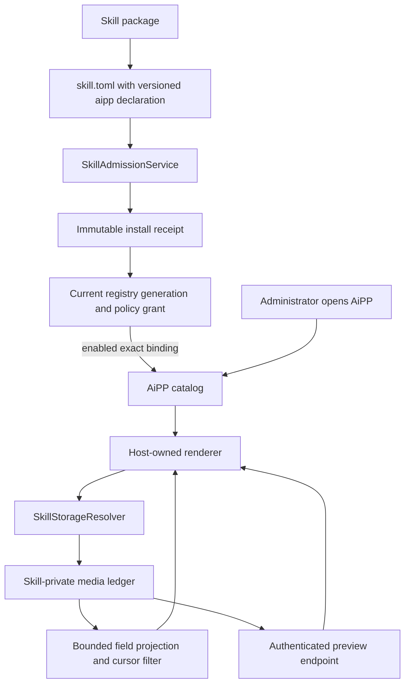

# AiPP Skill Companion Interfaces

<!-- ai-learning-stage: capabilities-artifacts -->
<!-- ai-learning-audience: operator,developer -->

<!-- ai-learning-navigation:start -->
Previous: [NNI capability and heartbeat control](13-nni-capability.md) |
[Architecture index](README.md)
<!-- ai-learning-navigation:end -->

AiPP gives an enabled skill a task-oriented visual companion for results that are
too rich or numerous for a chat stream. It does not replace Agent: users still ask
Agent to start, stop, or change work, while AiPP presents the persisted results.
`media_discovery` is the first implementation.

## Current User Flow

The top-level UI entry is named AiAPP and appears for administrators. Its catalog contains only
enabled packages whose exact admitted manifest declares a supported `[aipp]`
contract. The first view arranges those packages as application launchers; a
user selects one launcher before its task-oriented view opens. The browser
persists that selection in the neutral product storage namespace, so a refresh
returns to the same application. Media Discovery presents current collection
state, image and video records, recognized text, capture-time platform
engagement counters, source links, filters, and stable cursor pagination. Video
covers are best-effort platform adapters: the collector uses an unobscured
rendered video frame or a platform-specific rendered poster and never
substitutes a page or login screenshot. Available covers are served from the
skill's private export directory through an authenticated preview endpoint.
Remote image URLs must use HTTPS and are loaded without a referrer.

Starting, pausing, resuming, and stopping collection remain Agent actions. This
keeps one natural-language capability path across the browser and communication
channels instead of adding a second control protocol to the UI.

## Admission and Read Flow



For an admitted package, the runtime verifies the current binding, package
version, manifest digest, install receipt digest, policy grant, enable state, and
registry generation before exposing it. A repository package without a runtime
binding is read from the base registry, subject to the same enable state.
Disabling, revoking, updating, or uninstalling a skill changes AiPP availability
with the same transaction; no UI-only installation state exists.

## Security and Extension Boundary

AiPP is a host-rendered contract, not an application plugin sandbox. Schema
version 1 accepts only reviewed renderer and data-contract identifiers. Packages
provide localized labels and an icon token, but cannot provide JavaScript, HTML,
remote modules, stylesheet URLs, or same-origin frames. Adding a new renderer or
data contract requires a reviewed host implementation and manifest validation.

The media contract exposes an allowlist of presentation fields. It never returns
browser profiles, cookies, credentials, raw diagnostics, arbitrary record fields,
or unrestricted filesystem paths. Preview path resolution canonicalizes the
requested file, requires it to remain under the skill's `exports` directory,
allows only bounded image types and sizes, and sends private no-sniff responses.
The Media Discovery collector keeps a private persistent browser profile per
platform so later runs can reuse that platform's cookies, local storage, and
cache. Clearing collected records leaves this private session profile intact;
the profile itself is never exposed through the AiAPP API.
The record scan and page size are bounded. An unfiltered first page seeks by the
sequence encoded in immutable record filenames and parses only one page plus a
lookahead record. Filtered views scan the bounded ledger to preserve exact
matching totals. Video previews load only when their cards approach the
viewport.

Media Discovery currently uses one host-global private directory, so its AiPP is
administrator-only. A future per-user AiPP must first declare and enforce an
owner-scoped storage contract; hiding a global data view in the browser is not an
authorization boundary.

## Package Contract

The optional manifest section contains:

```toml
[aipp]
schema_version = 1
renderer = "collection_feed_v1"
data_contract = "media_collection_v1"
icon = "gallery_vertical_end"
default_locale = "en"
titles = { en = "Media Discovery", zh = "媒体发现" }
descriptions = { en = "Review collected media.", zh = "查看已采集内容。" }
```

The manifest is part of the immutable package digest and receipt. Runtime-imported
skills therefore install, update, disable, and uninstall their AiPP through the
same admission lifecycle as the skill itself.
