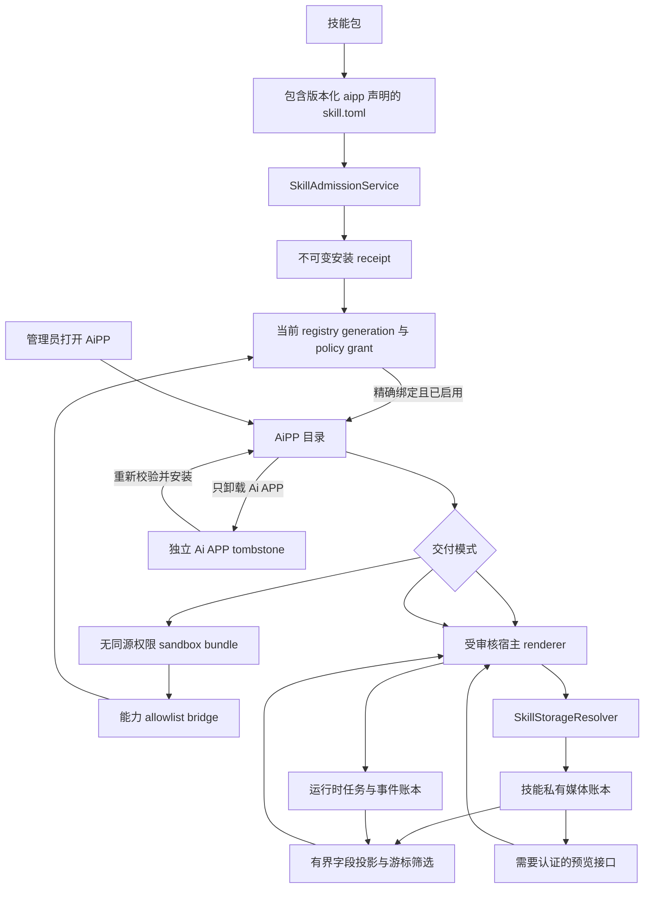

# AiPP 技能配套界面

<!-- ai-learning-stage: capabilities-artifacts -->
<!-- ai-learning-audience: operator,developer -->

<!-- ai-learning-navigation:start -->
上一页：[NNI 能力与心跳控制](13-nni-capability.zh-CN.md) |
下一页：[AiAPP 开发手册](15-aipp-development-guide.zh-CN.md) |
[架构索引](README.md)
<!-- ai-learning-navigation:end -->

AiPP 为已启用技能提供面向任务的配套界面，用来展示不适合放进聊天流的大量或复杂结果。
它不会替代 Agent：用户仍通过 Agent 开始、停止或调整任务，AiPP 负责呈现保留的结果。
当前宿主渲染实现包括 `media_discovery` 和 `media_download`。

## 当前用户流程

顶层 UI 入口名为 AiAPP，只对管理员显示。目录中只包含当前已经启用、且精确准入 manifest 声明了
受支持 `[aipp]` 合同的技能。单独卸载的应用在技能仍启用时会保留为“可重新安装”的入口。
第一页把这些技能排列成应用图标，用户点击应用后才进入对应的
任务视图。浏览器会在中性产品存储命名空间中保留当前应用，刷新后仍回到该应用。媒体发现
界面展示当前采集状态、图片和视频记录、作者自带文案、采集时平台互动指标、来源链接、筛选和
稳定游标分页。媒体下载界面只展示实际执行过媒体下载技能的保留任务，包括 Agent UI 与外部
通信端提交的请求，并显示原始请求与公开来源链接、模型最终
整理结果、失败信息和经过鉴权的输出附件。视频封面按平台尽力获取：采集器只使用无遮挡的渲染视频帧或平台专属 poster，
不会把整页或登录弹窗截图当作封面。可用封面通过需要认证的预览接口从技能私有导出目录读取；
已采集图片截图通过同一接口预览和下载，远程 HTTPS 图片只作为不带 referrer 的兜底。

点击图片或已采集的视频封面，会先打开共用的大图查看窗口，不会直接下载。窗口右下角的
下载按钮继续使用原有鉴权预览或任务附件接口。查看器适配电脑、手机和明暗主题，图片加载或
下载失败时可以重试，也可以通过关闭按钮、背景遮罩或 Esc 退出。文本、音频和视频附件保留
各自原有的预览、下载行为。这是通用宿主展示能力，不增加按技能名区分的核心路由，也不改变
AiAPP 的安装合同。

不同平台由同一个后台调度器并行采集，批次锁、数量上限、截止时间、登录等待和冷却时间各自独立。
同一平台不能重复启动，新开启的平台可以加入正在运行的调度器。停止或暂停只让选定平台在
完成当前整条帖子后收尾，其他平台继续运行。根据系统或容器内存限制，低于 4 GiB 最多运行一个
平台，4 至不足 8 GiB 两个，8 GiB 及以上三个。记录编号、去重和 CSV 提交仍使用短时间写锁。
技能向 AiAPP 提供活动批次汇总，不增加按平台区分的核心或 UI 路由。

开始、暂停、恢复和停止采集仍是 Agent action。这样浏览器与通信端继续共用同一条自然语言
能力链路，不会在 UI 中新增第二套控制协议。

## 准入与读取流程



对于已经准入的包，runtime 会在展示前验证当前 binding、包版本、manifest digest、安装
receipt digest、policy grant、启用状态和 registry generation。没有运行时 binding 的仓库
内包从 base registry 读取，同样受启用状态约束。禁用、撤销 grant、升级或卸载技能时，
AiPP 可用性与同一事务一起变化。管理员也可以只卸载 Ai APP：宿主写入一个 overlay tombstone，
不改变技能执行、配置或私有数据。重新安装 Ai APP 时，只有当前技能包再次通过 manifest、
receipt 和 generation 校验后才清除 tombstone。

## 安全与扩展边界

采集视图按平台与有效 `post_sequence` 分组，不按文案合并。每篇图文只展示一张卡片和一份
文案，图片仍能顺序切换、放大和下载。每页按最多 20 篇帖子补齐，而不是只读取 20 张素材；
页面边界通过游标补齐连续图集，最多追加 20 次有界请求，不消耗下一页帖子的记录。
全部平台仍按采集时间排列，较早采集的平台可以出现在后续页；切换平台会回到第一页。
原图片记录和 CSV 行仍独立可寻址；已有数据无需重新采集或迁移
即可应用这项通用展示规则。

AiPP 提供两种宿主读取合同和一种 sandbox 扩展模式。`collection_feed_v1` 读取有界的技能私有
采集账本；`task_activity_v1` 只根据结构化技能执行事件选择任务，再投影有界输入/结果文本、
规范 action、校验后的公开链接和任务附件地址。manifest 可声明包含全部任务入口，或只包含
外部通信端；该合同不会混入其他技能的私有记录。`sandbox_bundle_v1` 是通用扩展边界，技能包可以在一个声明过的目录中携带静态 HTML、CSS、
JavaScript、JSON、图片和字体。安装器会把每个文件复制到不可变安装目录，并把大小与摘要写入
receipt artifact。运行时只允许读取当前精确版本，把路径限制在声明目录内，检查文件类型与大小，
并返回 private cache、no-sniff 和 CSP header。

浏览器使用带 `allow-scripts allow-downloads`、但不带 `allow-same-origin` 的 iframe 运行应用。
应用拿不到 API key、Cookie、父页面 DOM、本地存储、任意网络访问或原始文件路径。唯一执行出口
是版本化 `postMessage` bridge：父页面先核对发送窗口、请求结构和 manifest 中的
`bridge_capabilities` allowlist，再走普通 direct-capability task 链路。因此 resolver、verifier、
policy、确认、task journal 和 artifact 控制继续与 Agent 共用。以后新增 sandbox Ai APP 不需要
再给 `clawd` 增加技能专用路由，也不需要给主 UI 增加业务组件。

## 开发边界

普通 Ai APP 接入只修改对应技能包：在 `skill.toml` 声明 `[aipp]`，复用已经审核的宿主数据
合同，或把独立构建的静态应用放入技能包自己的 `aipp/` 目录。主 UI 构建不得导入或编译技能
前端源码。安装、升级和卸载只修改不可变包/receipt 与 data-root Ai APP overlay 状态，不重新
编译或重启 `clawd`，不重新编译主 UI，也不改变技能自身的启用、配置和私有数据状态。

宿主代码可以实现版本化、可复用的数据/capability 合同，但不得按具体技能名分支。确实需要
新增宿主合同时，应当作为 runtime 平台变更单独做 schema 与安全审查，不能混在普通 Ai APP
安装中。修改 Ai APP manifest、宿主合同、包内资产或目录后，运行
`python3 scripts/check_aipp_decoupling.py --self-test && python3 scripts/check_aipp_decoupling.py`。

宿主合同只暴露展示字段白名单，不返回浏览器 profile、cookie、凭据、外部通信身份、教学
trace、任务 journal、原始诊断、任意记录字段或不受限制的文件路径。任务活动合同不会匹配
用户或模型自然语言来识别技能；当前与归档的 `tool_finished` 事件是唯一依据。预览路径会规范化并确认仍位于技能自己的 `exports` 目录内，只
允许有大小上限的图片类型，并返回 private、no-sniff 响应。记录扫描量和分页大小均有上限。
媒体发现采集器为每个平台维护独立的持久浏览器 profile，后续采集会复用该平台的 Cookie、
Local Storage 和缓存。清理采集记录不会删除这份登录态，AiAPP API 也不会暴露 profile 内容。
无筛选第一页根据不可变记录文件名中的序号定位，只解析一页加一条前瞻记录；有筛选时才扫描
有界账本以给出准确匹配总数。视频预览只在卡片接近可视区时加载。

媒体发现目前使用一个宿主全局私有目录，因此该 AiPP 只允许管理员访问。未来的用户级 AiPP
必须先声明并执行按 owner 隔离的存储合同；仅在浏览器中隐藏全局数据不构成授权边界。

## 包合同

可选 manifest 段如下：

```toml
[aipp]
schema_version = 1
renderer = "collection_feed_v1"
data_contract = "media_collection_v1"
icon = "gallery_vertical_end"
default_locale = "en"
titles = { en = "Media Discovery", zh = "媒体发现" }
descriptions = { en = "Review collected media.", zh = "查看已采集内容。" }
```

如果保留的任务结果已经包含展示所需数据，技能可直接复用任务活动合同，不需要增加技能专用
宿主路由或复制一份私有数据：

```toml
[aipp]
schema_version = 1
renderer = "task_activity_v1"
data_contract = "skill_task_activity_v1"
task_channel_scope = "all"
icon = "download"
default_locale = "en"
titles = { en = "Media Download", zh = "媒体下载" }
descriptions = { en = "Review media processing history.", zh = "查看媒体处理记录。" }
```

通用 sandbox 应用使用同一段合同：

```toml
[aipp]
schema_version = 1
renderer = "sandbox_bundle_v1"
data_contract = "capability_bridge_v1"
asset_root = "aipp"
entrypoint = "aipp/index.html"
bridge_capabilities = ["example.status", "example.list"]
icon = "panels_top_left"
default_locale = "en"
titles = { en = "Example", zh = "示例" }
descriptions = { en = "Review example results.", zh = "查看示例结果。" }
```

bridge 中的每个 capability 也必须存在于包自己的 capability request 中，并继续受宿主 policy
grant 约束。远程模块、宿主认证信息、未声明能力名、路径穿越、软链接和不支持的资源类型都会被拒绝。

bundle 通过版本化消息报告就绪并调用能力：

```json
{"schema_version":1,"type":"aipp.ready"}
{"schema_version":1,"type":"aipp.capability.invoke","request_id":"status-1","capability":"example.status","args":{}}
```

宿主返回 `aipp.host.context` 和 `aipp.capability.result`。每个 frame 同时最多发起四个请求，参数
序列化大小也受限制。包内代码只能根据结构化结果生成自己的多语言界面，不得解析模型自然语言，
也不得复制控制台认证逻辑。

新增应用时，现有 schema 合适就复用受审核宿主合同；否则把静态文件放到 `<skill>/aipp`，声明
通用 sandbox 合同和精确 bridge capability，再走现有技能准入流程。不得把应用名、路由、字段
或 renderer 代码添加到 `clawd` 或主 UI。

manifest 会进入不可变包 digest 与 receipt。运行时导入技能通过与技能相同的 admission 生命周期
安装和升级 Ai APP；独立卸载状态只控制界面，不修改或卸载技能。
