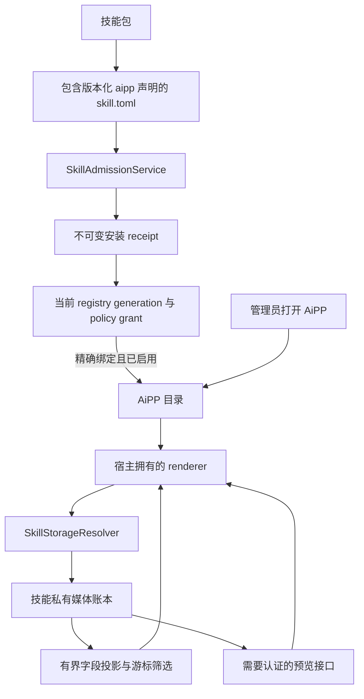

# AiPP 技能配套界面

<!-- ai-learning-stage: capabilities-artifacts -->
<!-- ai-learning-audience: operator,developer -->

<!-- ai-learning-navigation:start -->
上一页：[NNI 能力与心跳控制](13-nni-capability.zh-CN.md) |
[架构索引](README.md)
<!-- ai-learning-navigation:end -->

AiPP 为已启用技能提供面向任务的配套界面，用来展示不适合放进聊天流的大量或复杂结果。
它不会替代 Agent：用户仍通过 Agent 开始、停止或调整任务，AiPP 负责呈现已经持久化的结果。
`media_discovery` 是第一个实现。

## 当前用户流程

顶层 UI 入口名为 AiAPP，只对管理员显示。目录中只包含当前已经启用、且精确准入 manifest 声明了
受支持 `[aipp]` 合同的技能。第一页把这些技能排列成应用图标，用户点击应用后才进入对应的
任务视图。浏览器会在中性产品存储命名空间中保留当前应用，刷新后仍回到该应用。媒体发现
界面展示当前采集状态、图片和视频记录、作者自带文案、单独的画面识别文字、采集时平台互动指标、来源链接、筛选和
稳定游标分页。视频封面按平台尽力获取：采集器只使用无遮挡的渲染视频帧或平台专属 poster，
不会把整页或登录弹窗截图当作封面。可用封面通过需要认证的预览接口从技能私有导出目录读取；
远程图片地址必须使用 HTTPS，并且浏览器请求不会携带 referrer。

开始、暂停、恢复和停止采集仍是 Agent action。这样浏览器与通信端继续共用同一条自然语言
能力链路，不会在 UI 中新增第二套控制协议。

## 准入与读取流程



对于已经准入的包，runtime 会在展示前验证当前 binding、包版本、manifest digest、安装
receipt digest、policy grant、启用状态和 registry generation。没有运行时 binding 的仓库
内包从 base registry 读取，同样受启用状态约束。禁用、撤销 grant、升级或卸载技能时，
AiPP 可用性与同一事务一起变化，不存在 UI 自己维护的安装状态。

## 安全与扩展边界

AiPP 是宿主渲染合同，不是应用插件沙箱。schema version 1 只接受经过审核的 renderer 与
数据合同标识。技能包可以提供本地化标签和图标 token，但不能提供 JavaScript、HTML、远程
模块、样式表 URL 或同源 frame。增加新 renderer 或数据合同前，必须实现并审核对应的宿主
代码和 manifest 校验。

媒体合同只暴露展示字段白名单，不返回浏览器 profile、cookie、凭据、原始诊断、任意记录
字段或不受限制的文件路径。预览路径会规范化并确认仍位于技能自己的 `exports` 目录内，只
允许有大小上限的图片类型，并返回 private、no-sniff 响应。记录扫描量和分页大小均有上限。
媒体发现采集器为每个平台维护独立的持久浏览器 profile，后续采集会复用该平台的 Cookie、
Local Storage 和缓存。清理采集记录不会删除这份登录态，AiAPP API 也不会暴露 profile 内容。
无筛选第一页根据不可变记录文件名中的序号定位，只解析一页加一条前瞻记录；有筛选时才扫描
有界账本以给出准确匹配总数。视频预览只在卡片接近可视区时加载。

媒体发现目前使用一个宿主全局私有目录，因此该 AiPP 只允许管理员访问。未来的用户级 AiPP
必须先声明并执行按 owner 隔离的存储合同；仅在浏览器中隐藏全局数据不构成授权边界。

## 包合同

可选 manifest 段如下：

```toml
[aipp]
schema_version = 1
renderer = "collection_feed_v1"
data_contract = "media_collection_v1"
icon = "gallery_vertical_end"
default_locale = "en"
titles = { en = "Media Discovery", zh = "媒体发现" }
descriptions = { en = "Review collected media.", zh = "查看已采集内容。" }
```

manifest 会进入不可变包 digest 与 receipt。运行时导入技能因此通过与技能相同的 admission
生命周期安装、更新、禁用和卸载 AiPP。
