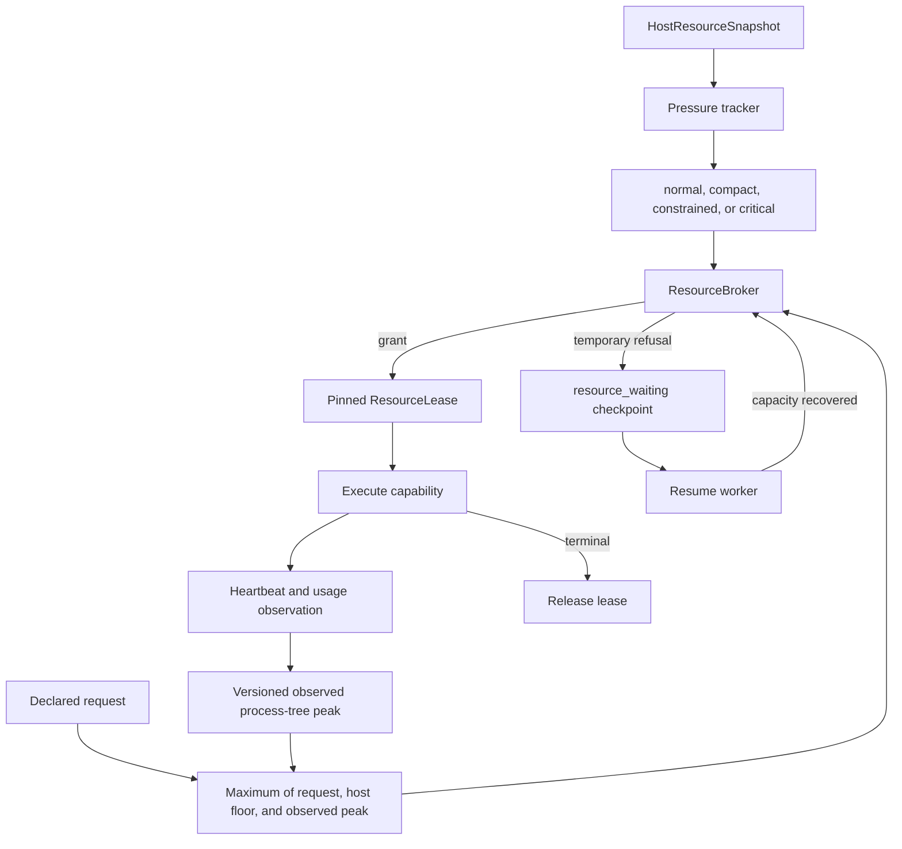

# Runtime Resource Admission and Recovery

<!-- ai-learning-stage: safety-operations -->
<!-- ai-learning-audience: operator,developer -->

<!-- ai-learning-navigation:start -->
Previous: [AiAPP development guide](15-aipp-development-guide.md) |
[Architecture index](README.md)
<!-- ai-learning-navigation:end -->

The runtime uses one host-owned resource policy for tools, process skills, browser sessions, local
models, durable jobs, and model-provider calls. Resource control is based on machine contracts and
current host capacity. It never classifies user intent or parses user-visible text.

## Admission Flow

Admission reserves memory, CPU, network, provider, and browser slots atomically. A durable process
persists only non-secret lease metadata, process identity, heartbeat, and terminal markers. Startup
reconciliation rebuilds a live lease or releases a terminal one. It does not infer state from output
prose, skill names, executable extensions, or current package pointers.

## Resource Tiers

| Tier | Runtime behavior |
| --- | --- |
| `normal` | Uses configured concurrency ceilings while retaining the safety reserve. |
| `compact` | Serializes heavy background work and keeps bounded foreground capacity. |
| `constrained` | Serializes heavy skills, browsers, and local models; idle pools are minimized. |
| `critical` | Refuses new heavy work, reclaims idle processes, and checkpoints recoverable work. Lightweight cancellation and status controls remain available. |

The tier comes from effective memory limit, available memory, cgroup events, and pressure metrics
with escalation and recovery hysteresis. Device brand, hostname, and CPU architecture are not policy
inputs. Unsupported platform metrics remain unavailable and activate conservative defaults.

## Waiting and Recovery

When capacity is temporarily unavailable, the runtime records a bounded machine checkpoint with the
reason, resource request, attempt count, next recovery time, and pinned execution binding. Repeated
refusals use bounded backoff. The task remains cancelable and steerable, and successful side effects
are not replayed. Recovery resumes the same task after capacity returns.

The UI, CLI, and communication channels present waiting from lifecycle machine fields. They do not
translate an English or Chinese error sentence back into control state. Raw cgroup paths, process
IDs, request bodies, credentials, and private artifacts are excluded from ordinary status output and
diagnostic exports.

## Administrator Overrides

The optional `[runtime_resources]` table in `configs/config.toml` is the only threshold override.
Supported values cover safety reserve, available-memory ratios, PSI thresholds, and escalation and
recovery sample counts. Invalid or non-monotonic values fail startup. Overrides may tighten or relax
capacity within host safety limits, but they cannot bypass permissions, confirmation, sandboxing,
receipt pinning, or task idempotency.

## Validation

The acceptance boundary includes:

- host/cgroup/macOS metric parsing, OOM-event escalation, and hysteresis;
- atomic memory, CPU, network, provider, and browser leases;
- panic, cancellation, timeout, browser-process loss, and daemon-restart recovery;
- 1 GiB, 1.5 GiB, 2 GiB, and 4 GiB isolated pressure runs without OOM or duplicate side effects;
- local Linux, Raspberry Pi aarch64, and macOS process-tree probes;
- file, web, browser, background resume, channel receipt, media, and local-model paths;
- registry-complete built-in natural-language coverage without phrase-specific routing patches.

Use `scripts/runtime_memory_probe.py` for process-tree evidence and
`docs/architecture/runtime_memory_profile.md` for measured storage and allocator details. A memory
report must compare equivalent workloads and include PSS plus SwapPss on Linux; RSS alone can make
swapped history look like an improvement.

## Rollback Boundaries

If a threshold change causes excessive waiting, revert only `[runtime_resources]` to automatic
policy or the previous validated values. If execution behavior regresses, roll back the complete
runtime package so the core, runner, registry contracts, and UI remain version-aligned. Do not work
around pressure by disabling authorization, verifier checks, durable journals, or skill receipt
validation.
