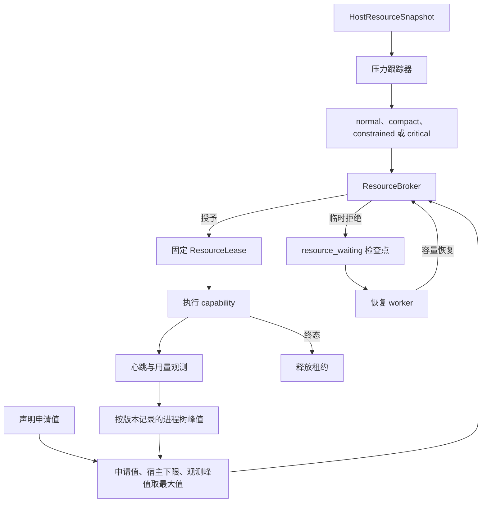

# 运行期资源准入与恢复

<!-- ai-learning-stage: safety-operations -->
<!-- ai-learning-audience: operator,developer -->

<!-- ai-learning-navigation:start -->
上一页：[AiAPP 开发手册](15-aipp-development-guide.zh-CN.md) |
[架构索引](README.md)
<!-- ai-learning-navigation:end -->

运行时使用一套宿主拥有的资源策略，统一约束工具、进程型技能、浏览器、本地模型、持久任务和
模型供应商调用。资源控制只读取机器合同和当前宿主容量，不判断用户意图，也不解析用户可见文本。

## 准入流程

准入会原子预留内存、CPU、网络、供应商和浏览器 slot。持久进程只保存无敏感内容的租约元数据、
进程身份、心跳和终态标记。服务启动时核对这些记录，恢复仍存活的租约或释放已经结束的租约。
运行时不会从输出文案、技能名、可执行文件扩展名或当前包指针猜测状态。

## 资源档位

| 档位 | 运行行为 |
| --- | --- |
| `normal` | 在保留安全余量的前提下使用配置的并发上限。 |
| `compact` | 重型后台工作串行，保留有界的前台容量。 |
| `constrained` | 重型技能、浏览器和本地模型串行，空闲进程池缩到最小。 |
| `critical` | 暂停新重型工作，回收空闲进程，为可恢复任务写检查点；取消和状态查询等轻量控制仍可用。 |

档位由有效内存上限、可用内存、cgroup 事件和压力指标共同决定，并带有升级/恢复滞回。设备品牌、
主机名和 CPU 架构不参与策略。平台不支持的指标明确保持 unavailable，并启用保守默认值。

## 等待与恢复

容量暂时不足时，运行时记录有界机器检查点，其中包含原因、资源申请、尝试次数、下次恢复时间和
固定执行绑定。连续拒绝采用封顶退避。任务仍可取消和修正，已经成功的副作用不会重放；容量恢复后，
恢复 worker 继续同一个任务。

UI、CLI 和通信端从生命周期机器字段展示等待状态，不会把中英文错误句子反向解析成控制状态。
普通状态接口和诊断导出不包含原始 cgroup 路径、PID、请求正文、凭据或私有工件。

## 管理员覆盖

`configs/config.toml` 的可选 `[runtime_resources]` 是唯一阈值覆盖入口。可配置安全余量、可用内存比例、
PSI 阈值以及升级/恢复采样数。非法或非单调值会阻止启动。覆盖值可以在宿主安全边界内收紧或放宽
容量，但不能绕过权限、确认、沙箱、收据固定或任务幂等合同。

## 验收范围

验收边界包括：

- 宿主、cgroup、macOS 指标解析，OOM 事件升级和压力滞回；
- 内存、CPU、网络、供应商和浏览器原子租约；
- panic、取消、超时、浏览器进程丢失和守护进程重启恢复；
- 1 GiB、1.5 GiB、2 GiB、4 GiB 隔离压力测试，无 OOM、无重复副作用；
- 本地 Linux、树莓派 aarch64 和 macOS 进程树探针；
- 文件、网页、浏览器、后台恢复、通信端收据、媒体和本地模型链路；
- 覆盖固定内置能力的自然语言测试，且不增加短语特判。

进程树证据使用 `scripts/runtime_memory_probe.py`；存储和分配器实测见
`docs/architecture/runtime_memory_profile.md`。Linux 报告必须在相同工作负载下比较 PSS 与 SwapPss
之和，只看 RSS 会把换出的历史内存误当作优化。

## 回滚边界

阈值导致过度等待时，只需把 `[runtime_resources]` 恢复为自动策略或上一组已验证值。执行行为发生
回归时，应整体回滚运行时包，保持核心、runner、registry 合同和 UI 版本一致。不得通过关闭鉴权、
verifier、持久 journal 或技能收据验证来绕过资源压力。
