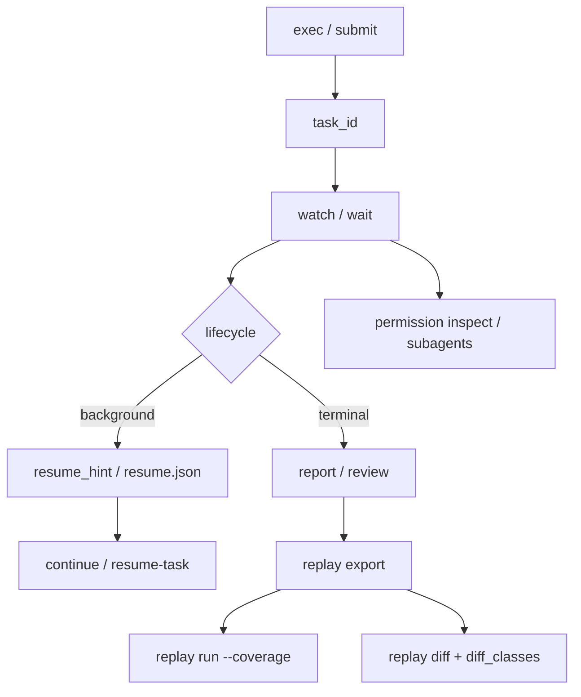

# clawcli Exec And Replay

`clawcli exec` is the script-friendly task runner for RustClaw. It submits an
`ask` task or resumes an existing task, waits by default, returns a stable exit
code, and can write machine-readable artifacts for CI.

`clawcli replay` exports and inspects recorded task bundles without calling live
model providers or tools by default.

## Exec Basics

Run an ask task and wait until terminal:

```bash
clawcli exec --json --timeout-seconds 120 "audit the current workspace without edits"
```

Submit and return immediately:

```bash
clawcli exec --detach --json "run a long safe read-only audit"
```

Resume an existing task id:

```bash
clawcli exec --resume-task-id "$TASK_ID" --json "continue from the current checkpoint"
```

Write CI artifacts:

```bash
clawcli exec \
  --json \
  --artifact-dir artifacts/rustclaw-exec \
  --timeout-seconds 600 \
  "make the requested code change and run the focused tests"
```

Inspect the effective machine config without submitting a task:

```bash
clawcli exec --profile long-tail --print-effective-config "audit current task state"
```

Artifact files:

| File | Contents |
| --- | --- |
| `summary.json` | Stable exec summary with `task_id`, status, lifecycle, exit class, event summary, `effective_config`, `resume_hint`, and artifact refs. |
| `task.json` | Full task query payload returned by `GET /v1/tasks/{task_id}`. |
| `events.jsonl` | Raw task event lines for later filtering or replay export. |
| `resume.json` | Stable recovery fields such as `task_id`, `checkpoint_id`, `resume_due`, `poll_ref`, `next_poll_after`, and `recommended_command_tokens`. |

## Exec Profiles

Profiles only set CLI machine parameters. They do not route natural language,
choose skills, or change planner behavior.

| Profile | Defaults |
| --- | --- |
| `quick` | `timeout_seconds=120` |
| `coding` | `timeout_seconds=900`, `artifact_dir=artifacts/rustclaw-exec/coding` |
| `release-gate` | `timeout_seconds=600`, `fail_on_background=true`, `artifact_dir=artifacts/rustclaw-exec/release-gate` |
| `long-tail` | `timeout_seconds=3600`, `continue_on_background=true`, `artifact_dir=artifacts/rustclaw-exec/long-tail` |

Explicit CLI flags override profile defaults where a value is provided:

```bash
clawcli exec --profile coding --timeout-seconds 1200 --json "make the focused change"
```

## Exit Classes

Scripts should use `exit_class` and `exit_code`, not localized visible text.

| Class | Code | Meaning |
| --- | ---: | --- |
| `success` | 0 | Terminal success, or accepted background state when `--continue-on-background` is used. |
| `failed` | 1 | Terminal failure not classified by a more specific machine token. |
| `cancelled` | 130 | Task was cancelled. |
| `timeout` | 124 | CLI wait timeout or terminal runtime timeout. |
| `needs_user` | 78 | Task is waiting for user input and `--fail-on-background` treats it as non-zero. |
| `policy_denied` | 77 | Machine tokens indicate a policy or permission denial. |
| `provider_unavailable` | 69 | Machine tokens indicate provider outage, rate limit, quota, or timeout. |
| `invalid_request` | 64 | Invalid CLI request, args, or schema validation failure. |
| `background` | 75 | Task is safely checkpointed/backgrounded and `--fail-on-background` was requested. |

## Background Behavior

By default, `clawcli exec` waits until the task reaches a terminal state or the
CLI timeout is reached. Background checkpoints can be treated explicitly:

```bash
clawcli exec --continue-on-background --json "start a long async media dry run"
clawcli exec --fail-on-background --json "start a release-gate dry run"
```

Use `--continue-on-background` when a checkpointed async/background state is an
acceptable script outcome. Use `--fail-on-background` when CI should stop unless
the task fully reaches terminal success.

## Task Control

Wait for a lifecycle class:

```bash
clawcli wait "$TASK_ID" --until terminal --timeout-seconds 600 --json
clawcli wait "$TASK_ID" --until background --json
```

Continue a checkpointed task:

```bash
clawcli continue "$TASK_ID" "use the existing checkpoint and continue"
clawcli resume-task "$TASK_ID" --checkpoint-id "$CHECKPOINT_ID"
```

Review coding evidence without parsing visible prose:

```bash
clawcli review "$TASK_ID" --json
clawcli subagents "$TASK_ID" --json
```

Inspect permission and capability policy machine fields:

```bash
clawcli permission inspect "$TASK_ID" --json
clawcli permission explain "$TASK_ID" --json
clawcli permission capability --capability image.generate --json
```

## CI Examples

Read-only audit:

```bash
clawcli exec \
  --json \
  --timeout-seconds 180 \
  --artifact-dir artifacts/audit \
  "inspect the repository and report risks without modifying files"
```

Code edit plus focused test:

```bash
clawcli exec \
  --json \
  --timeout-seconds 900 \
  --artifact-dir artifacts/edit-test \
  "implement the requested code change, then run the smallest affected tests"
```

Safe natural-language smoke:

```bash
clawcli exec \
  --json \
  --timeout-seconds 300 \
  --artifact-dir artifacts/nl-smoke \
  "exercise task submit, status, cancel, pause, resume, and dry-run skill paths without live external publishing"
```

Release-gate dry run:

```bash
clawcli exec \
  --json \
  --fail-on-background \
  --timeout-seconds 600 \
  --artifact-dir artifacts/release-gate \
  "run the release checks in dry-run mode and return a machine-readable failure if any gate is unresolved"
```

## Replay

Export a redacted bundle for a task:

```bash
clawcli replay export "$TASK_ID" --output artifacts/replay/task.json --json
```

Inspect a bundle without live providers or tools:

```bash
clawcli replay run artifacts/replay/task.json --json
clawcli replay run artifacts/replay/task.json --coverage
```

Compare two bundles:

```bash
clawcli replay diff artifacts/replay/before.json artifacts/replay/after.json --json
```

Current replay mode is `recorded_only`: it validates and summarizes the stored
bundle, compares stable machine fields, and does not replay live model/tool
calls. Deep deterministic step replay can be added later using the same bundle
format.

`replay diff` emits `diff_classes` for release-gate automation:

| Class | Meaning |
| --- | --- |
| `final_status_changed` | `status` or `lifecycle_state` changed. |
| `route_changed` | Route authority or route fingerprint changed. |
| `plan_changed` | Recorded action sequence changed. |
| `verifier_changed` | Verifier or repair summary changed. |
| `permission_changed` | Permission, policy, or command policy summary changed. |
| `tool_result_changed` | Tool/skill/capability result summary changed. |

## Flow



## Shell Completion

Generate completion scripts from the current CLI shape:

```bash
clawcli completions bash > ~/.local/share/bash-completion/completions/clawcli
clawcli completions zsh > ~/.zfunc/_clawcli
clawcli completions fish > ~/.config/fish/completions/clawcli.fish
```

The `completions` command is local-only and does not require a `clawd` server or
admin key.

## Boundary Rules

- `clawcli exec` and `clawcli replay` must consume machine fields such as
  `status`, `lifecycle_state`, `exit_class`, `message_key`, `error_code`,
  `event_type`, `permission_decision`, `command_policy`, `child_run_id`,
  `finding_refs`, and artifact refs.
- Scripts must not parse `result_text` or `error_text` to decide success,
  retry, routing, or policy.
- Example natural-language prompts in this document are operator examples only;
  they are not runtime matching rules.
