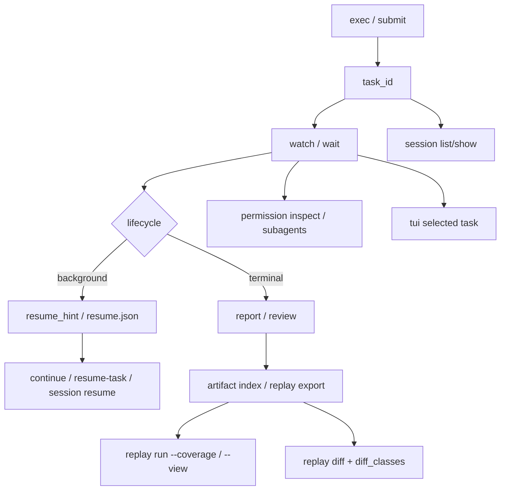

# clawcli Exec 与 Replay

`clawcli exec` 是 RustClaw 面向脚本的任务 runner。它提交 `ask` 任务或恢复已有任务，默认等待，返回稳定 exit code，并可为 CI 写入机器可读 artifact。

`clawcli replay` 导出和检查已记录任务 bundle，默认不调用实时模型 provider 或工具。

## Exec 基础

运行 ask 并等待终态：

```bash
clawcli exec --json --timeout-seconds 120 "audit the current workspace without edits"
```

使用 coding profile：

```bash
clawcli code --json "make the focused code change and run the affected tests"
```

提交后立即返回：

```bash
clawcli exec --detach --json "run a long safe read-only audit"
```

恢复 task ID：

```bash
clawcli exec --resume-task-id "$TASK_ID" --json "continue from the current checkpoint"
```

写入 CI artifact：

```bash
clawcli exec \
  --json \
  --artifact-dir artifacts/rustclaw-exec \
  --timeout-seconds 600 \
  "make the requested code change and run the focused tests"
```

不提交任务，只查看生效机器配置：

```bash
clawcli exec --profile long-tail --print-effective-config "audit current task state"
```

Artifact 文件：

| 文件 | 内容 |
| --- | --- |
| `summary.json` | Task ID、状态、lifecycle、exit class、event/LLM/coding 摘要、`effective_config`、`resume_hint` 和 artifact ref |
| `task.json` | `GET /v1/tasks/{task_id}` 返回的完整任务 payload |
| `events.jsonl` | 原始 task event 行 |
| `verification.json` | Coding verification、命令、测试、failure kind、状态、next step、checkpoint/resume 和残余风险 |
| `diff_summary.json` | Changed file 和有界 diff summary |
| `llm_summary.json` | LLM count、prompt bucket/bytes、truncation、retry、elapsed 和逐 prompt attribution |
| `resume.json` | Task/checkpoint ID、resume/poll、推荐命令 token、coding evidence、已完成副作用 ref 和 idempotency state |
| `index.json` | 上述 artifact 的稳定 kind/path 索引 |

非 JSON 输出在字段存在时显示 `exec_compact_budget_status`、`exec_compact_checkpoint_id`、`exec_compact_changed_file_count`、`exec_compact_verification_status`、`exec_compact_next_step`、`exec_compact_completed_side_effect_count` 和 `exec_compact_artifact_index`。它们只用于诊断，不选择 capability 或路由自然语言。

## Exec Profile

Profile 只设置 CLI 机器参数，不路由自然语言、不选技能、不改变 planner 行为。

| Profile | 默认值 |
| --- | --- |
| `quick` | `timeout_seconds=120` |
| `coding` | `timeout_seconds=900`，`artifact_dir=artifacts/rustclaw-exec/coding` |
| `release-gate` | `timeout_seconds=600`，`fail_on_background=true` |
| `long-tail` | `timeout_seconds=3600`，`continue_on_background=true` |

显式 CLI flag 覆盖 profile：

```bash
clawcli exec --profile coding --timeout-seconds 1200 --json "make the focused change"
```

## Exit Class

脚本使用 `exit_class`/`exit_code`，不得解析本地化文本。

| Class | Code | 含义 |
| --- | ---: | --- |
| `success` | 0 | 终态成功，或 `--continue-on-background` 接受后台状态 |
| `failed` | 1 | 未被更精确 token 分类的终态失败 |
| `cancelled` | 130 | 任务取消 |
| `timeout` | 124 | CLI wait 或 runtime terminal timeout |
| `needs_user` | 78 | 等待用户，且 `--fail-on-background` 要求非零 |
| `policy_denied` | 77 | Policy/permission 拒绝 |
| `provider_unavailable` | 69 | Provider outage/rate limit/quota/timeout |
| `invalid_request` | 64 | CLI 请求、参数或 schema 无效 |
| `background` | 75 | 安全 checkpoint/background，且要求 fail |

## 后台行为

默认等待终态或 CLI timeout：

```bash
clawcli exec --continue-on-background --json "start a long async media dry run"
clawcli exec --fail-on-background --json "start a release-gate dry run"
```

前者把安全后台 checkpoint 当作可接受脚本结果；后者要求 CI 必须完整成功。

## 任务控制

```bash
clawcli wait "$TASK_ID" --until terminal --timeout-seconds 600 --json
clawcli wait "$TASK_ID" --until background --json
clawcli continue "$TASK_ID" "use the existing checkpoint and continue"
clawcli resume-task "$TASK_ID" --checkpoint-id "$CHECKPOINT_ID"
clawcli review "$TASK_ID" --json
clawcli subagents "$TASK_ID" --json
```

查看 provider/LLM attribution：

```bash
clawcli report "$TASK_ID" --json
clawcli llm-trace "$TASK_ID"
clawcli llm-trace "$TASK_ID" --raw --limit 3
```

`llm-trace` 读取 `/v1/debug/tasks/{task_id}`，显示带编号 model call、flow stage/node、代码入口、provider/model/status 和 usage。`--raw` 额外显示已记录 request/response/clean/raw/error 字段；它不会调用模型或做语义决策。

权限与 capability：

```bash
clawcli permission inspect "$TASK_ID" --json
clawcli permission explain "$TASK_ID" --json
clawcli permission capability --capability image.generate --json
```

TUI：

```bash
clawcli tui --user-id 1 --chat-id 1
clawcli tui --user-id 1 --chat-id 1 --task-id "$TASK_ID" --once --json
```

TUI 保留 raw `selected_task`，并投影 `selected_progress`/`selected_summary`。按键 token 为：`r` refresh、`w` watch、`p` pause、`c` cancel、`u` resume、`n` continue、`e` export、`1` report、`2` review、`3` subagents、`4` permission、`q` quit。它们只调用现有 API 或渲染机器字段。

本地 session 导航：

```bash
clawcli session list --user-id 1 --chat-id 1 --json
clawcli session show "$TASK_ID" --json
clawcli session resume "$TASK_ID" "continue from the checkpoint" --json
clawcli session archive "$TASK_ID" --json
clawcli session fork "$TASK_ID" "$TASK_ID.fork" --json
clawcli session delete "$TASK_ID" --json
```

Session store 位于 `RUSTCLAW_CLAWCLI_SESSION_STORE`、`$XDG_STATE_HOME/rustclaw/` 或 `~/.local/state/rustclaw/`，只保存 CLI 导航机器元数据，不是服务端语义路由源。

## CI 示例

```bash
clawcli exec --json --timeout-seconds 180 --artifact-dir artifacts/audit \
  "inspect the repository and report risks without modifying files"

clawcli exec --json --timeout-seconds 900 --artifact-dir artifacts/edit-test \
  "implement the requested code change, then run the smallest affected tests"

clawcli exec --json --fail-on-background --timeout-seconds 600 \
  --artifact-dir artifacts/release-gate \
  "run the release checks in dry-run mode and return a machine-readable failure if any gate is unresolved"
```

## Replay

导出脱敏 bundle：

```bash
clawcli replay export "$TASK_ID" --output artifacts/replay/task.json --json
```

离线检查：

```bash
clawcli replay run artifacts/replay/task.json --json
clawcli replay run artifacts/replay/task.json --coverage
clawcli replay run artifacts/replay/task.json --view llm --json
clawcli replay run artifacts/replay/task.json --view tools --json
clawcli replay run artifacts/replay/task.json --view checkpoints --json
```

对比：

```bash
clawcli replay diff artifacts/replay/before.json artifacts/replay/after.json --json
```

当前 replay mode 为 `recorded_only`：只验证/汇总 stored bundle 并比较稳定机器字段，不实时重放模型/工具。`replay export` 从 durable event archive 分页读取，保留脱敏机器 envelope、seq、schema version、timestamp 和 hash chain，不受 1,024-event hot SSE 后缀限制；没有 archive 时使用有界旧 task-result projection。

`replay diff` 分类：

| Class | 含义 |
| --- | --- |
| `final_status_changed` | Status 或 lifecycle state 改变 |
| `route_changed` | Route authority/fingerprint 改变 |
| `plan_changed` | Action sequence 改变 |
| `verifier_changed` | Verifier/repair summary 改变 |
| `permission_changed` | Permission/policy/command policy 改变 |
| `tool_result_changed` | Tool/skill/capability result 改变 |

## 流程



## Shell Completion

```bash
clawcli completions bash > ~/.local/share/bash-completion/completions/clawcli
clawcli completions zsh > ~/.zfunc/_clawcli
clawcli completions fish > ~/.config/fish/completions/clawcli.fish
```

`completions` 是本地命令，不需要 `clawd` 或 admin key。

## 边界规则

- `exec/replay` 消费 status、lifecycle、exit class、message/error code、event type、permission/command policy、child run、finding、isolation/sandbox 和 artifact ref 等机器字段。
- 脚本不得解析 `result_text/error_text` 决定成功、retry、routing 或 policy。
- 文档中的 NL prompt 只是 operator 示例，不是 runtime 匹配规则。
