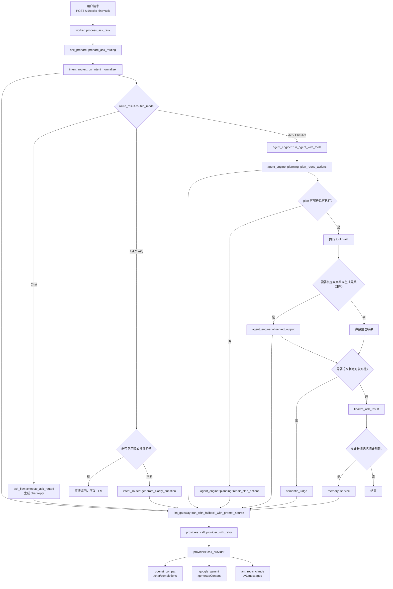
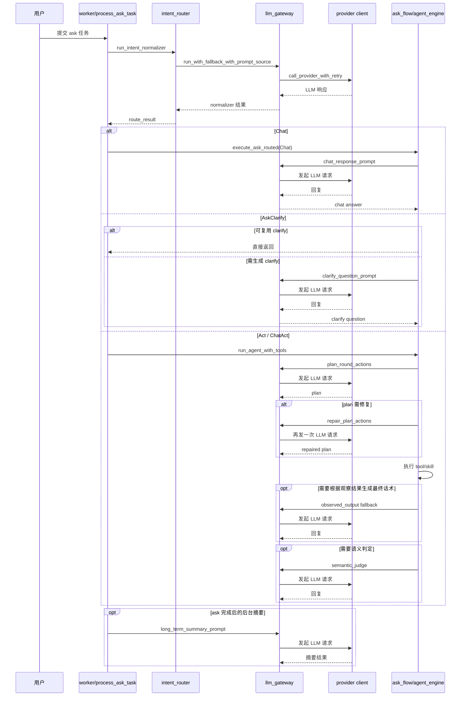

# LLM Request Flow

本文记录当前 `clawd` 中会触发 LLM 请求的主要层级，以及 `ask` 主链路的大致调用顺序。

当前仓库默认配置位于 `configs/config.toml`：

- `selected_vendor = "minimax"`
- `selected_model = "MiniMax-M2.7"`
- `llm.minimax` 未设置 `api_format`

因此当前默认实际请求链路是：

`MiniMax -> openai_compat -> /chat/completions`

## Ask Main Flow

## Ask Sequence

## Runtime Layers

从“业务层”到“真正出网”的层次可以概括为：

1. 业务调用层：`intent_router`、`ask_flow`、`agent_engine`、`semantic_judge`、`memory::service`
2. 统一网关层：`llm_gateway::run_with_fallback_with_prompt_source`
3. 重试与 provider 选择层：`providers::call_provider_with_retry`
4. 协议适配层：`providers::call_provider`
5. 厂商接口层：
   - `openai_compat -> /chat/completions`
   - `google_gemini -> :generateContent`
   - `anthropic_claude -> /v1/messages`

## Notes

- 大多数 LLM 调用统一走 `llm_gateway`
- 少数旁路会直接打 provider，例如：
  - `skills/builtin.rs` 里的 `run_cmd` NL2CMD
  - `http/ui_routes.rs` 里的 LLM 连通性测试
