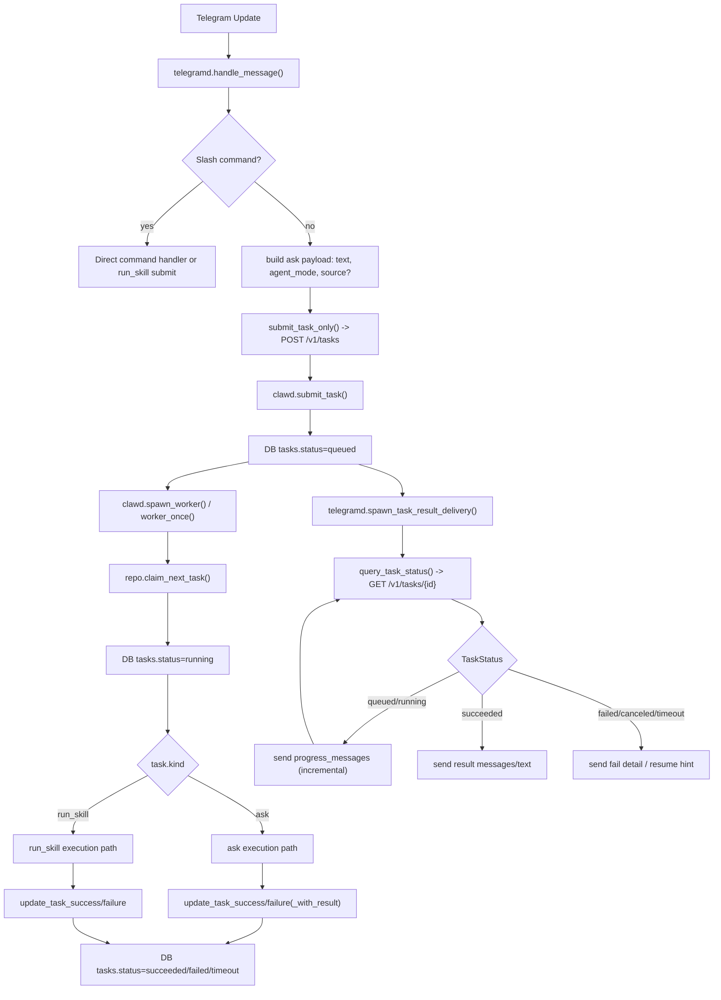
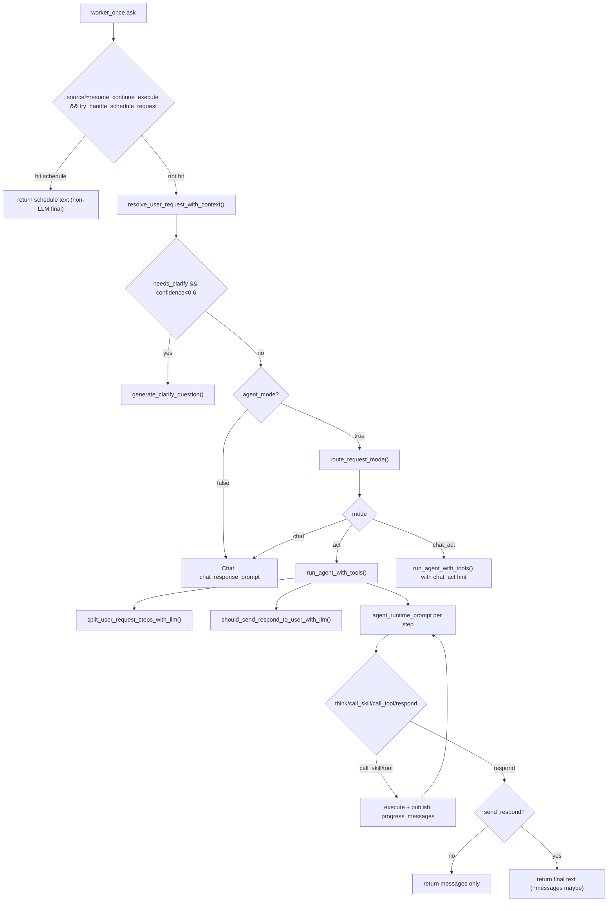

# Telegram 主链执行逻辑与 LLM 调用全流程（`telegram_core`）

本文档描述 RustClaw 在 Telegram 通道下的主执行链路，覆盖：

- 入站消息 -> 任务提交 -> clawd Worker 执行 -> 状态回传
- 路由决策（`chat` / `act` / `chat_act` / `schedule` 直通）
- LLM 调用点、Prompt 模板、输出 schema、fallback
- Agent 循环、收敛策略、去重与安全护栏
- `tasks` 表状态流转和用户可见消息生成规则

---

## 1. 组件与职责

- `telegramd`（`crates/telegramd/src/main.rs`）
  - 接收 Telegram Update（消息/按钮）
  - 组装 `SubmitTaskRequest` 调用 clawd HTTP API
  - 轮询任务状态并向用户发送 progress/success/failure
- `clawd`（`crates/clawd/src/main.rs`）
  - 接收任务（`POST /v1/tasks`）与查询任务（`GET /v1/tasks/{id}`）
  - Worker 领取并执行 `ask` / `run_skill`
  - 在执行过程中更新 `tasks.result_json`（含 progress）
- `intent_router`（`crates/clawd/src/intent_router.rs`）
  - 上下文重写、澄清问题、模式路由、图像尾部判定
- `agent_engine`（`crates/clawd/src/agent_engine.rs`）
  - Act/ChatAct 模式下的循环执行器（LLM 决策 + skill/tool 执行）
- `llm_gateway`（`crates/clawd/src/llm_gateway.rs` + `main.rs`）
  - Provider fallback + retry + 审计日志

---

## 2. 端到端主流程图（Telegram 主链）

静态图（PNG，便于不支持 Mermaid 的渲染环境查看）：

---

## 3. Ask 主路径（函数级细节）

### 3.1 Telegram 入站与任务提交

1. `handle_message()` 解析消息（`user_id/chat_id/text`）。
2. 普通文本走 `submit_task_only(..., TaskKind::Ask, payload)`。
3. payload 常见字段：
   - `text`
   - `agent_mode`
   - 可选：`source`（如 `resume_continue_execute`）
4. `submit_task_only()` 调 clawd：
   - `POST /v1/tasks`
   - body 为 `SubmitTaskRequest`。
5. 提交成功后立即 `spawn_task_result_delivery(...)` 异步轮询。

### 3.2 clawd 入队与 worker 执行

1. `submit_task()` 写入 `tasks`（`status='queued'`）。
2. `worker_once()` 调 `repo::claim_next_task()`：
   - 原子改为 `status='running'`。
3. `kind="ask"` 分支：
   - 提取 `payload.text` 为 prompt
   - 若 `source=="resume_continue_execute"`，构造 resume prompt
   - 非 resume 先尝试 `try_handle_schedule_request()`
4. 进入上下文与路由：
   - `resolve_user_request_with_context()`
   - 根据 `needs_clarify/confidence` 决定是否澄清
   - `agent_mode=true` 时调用 `route_request_mode()`
   - 分流：
     - `Chat` -> `chat_response_prompt` 直接 LLM 回答
     - `Act` -> `run_agent_with_tools()`
     - `ChatAct` -> `Mode hint: chat_act` 后进 `run_agent_with_tools()`
5. 执行结果落库：
   - 成功：`update_task_success()`
   - 失败：
     - 普通失败：`update_task_failure()`
     - 可恢复失败：`update_task_failure_with_result()`，`result_json` 含 `resume_context`

### 3.3 Telegram 轮询与回传

`spawn_task_result_delivery()` 按状态处理：

- `Queued/Running`：
  - 从 `result_json.progress_messages` 增量发送
- `Succeeded`：
  - 优先发送 `result_json.messages[]`
  - 否则发 `result_json.text`
- `Failed/Canceled/Timeout`：
  - 发送 `error_text` 或拼接失败信息
  - 有 `resume_context` 时写入 `pending_resume_by_chat` 并发中断提示

---

## 4. LLM 调用与路由子流程图

静态图（PNG，便于不支持 Mermaid 的渲染环境查看）：

---

## 5. LLM 调用矩阵（触发条件 / 模板 / 输出）

| 调用点 | 触发条件 | Prompt 模板 | 输出约定 | 失败回退 |
|---|---|---|---|---|
| 上下文重写 | Ask 主路径（schedule 未直返） | `prompts/context_resolver_prompt.md` | JSON: `resolved_user_intent/needs_clarify/confidence/reason` | 回退原始请求 |
| 澄清问题 | `needs_clarify && confidence < 0.6` | `prompts/clarify_question_prompt.md` | 文本问句 | i18n 默认澄清文案 |
| 路由判定 | `agent_mode=true` | `prompts/intent_router_prompt.md` + `prompts/intent_router_rules.md` | JSON: `mode/reason/confidence/evidence_refs` | 回退 `Chat` |
| Chat 回复 | 路由到 Chat | `prompts/chat_response_prompt.md` | 文本 | 交给 llm_gateway fallback |
| Step 拆分 | 进入 `run_agent_with_tools` | `prompts/step_split_strict.md` | JSON: `steps[]` | 回退单步原请求 |
| Respond 发送判定 | 进入 `run_agent_with_tools` | `prompts/respond_delivery_intent_prompt.md` | JSON: `send_respond/reason` | 默认 `false`（不发 respond） |
| Act 每步动作 | Agent 循环每 step | `prompts/agent_runtime_prompt.md` + tool/spec + skill prompts + 动态规则 | JSON action: `think/call_skill/call_tool/respond` | 解析失败继续修复/重试逻辑 |
| 图像尾部判定 | Respond 分支 | `prompts/image_tail_routing_prompt.md` | JSON: `image_goal` | 默认 `false` |
| run_cmd 失败建议 | tool=run_cmd 失败 | `prompts/command_failure_suggest_prompt.md` | 文本建议 | 忽略建议继续错误路径 |
| schedule 意图解析 | `try_handle_schedule_request` | `prompts/schedule_intent_prompt.md` + `prompts/schedule_intent_rules.md` | 结构化 schedule intent JSON | 视为非 schedule |

---

## 6. Agent 循环与收敛机制（`run_agent_with_tools`）

### 6.1 执行循环

- 主循环：`for step in 1..=AGENT_MAX_STEPS`
- 每轮：
  1. 组装 runtime prompt（含 `history` + `DYNAMIC_CONVERGENCE_RULES`）
  2. LLM 产出 action
  3. 执行 action 并记录 `history`
  4. 必要时写入 `progress_messages`

### 6.2 关键护栏

- 全局预算：
  - `AGENT_MAX_STEPS=32`
  - `AGENT_MAX_TOOL_CALLS=12`
  - `AGENT_REPEAT_SAME_ACTION_LIMIT=4`
- 重复动作防护：
  - `action_signature + repeat_state_fingerprint(...)` 计数超限中断
- 查询收敛：
  - `market_query_actions` 含 `quote/get_price/get_multi_price/get_book_ticker/positions`
  - 同签名重复直接短路返回
  - 成功后允许 **一次参数变化重试**，之后继续短路
- 交易收敛：
  - 同任务最多一次 `trade_submit` 成功（硬限制）
  - `trade_preview` 后进入等待确认态，抑制后续无关动作
- `respond` 可见性：
  - 先经 `respond_delivery_intent_prompt` 判定 `send_respond`
  - `send_respond=false` 时，`respond` 只作为内部收尾，不发送用户可见文本

### 6.3 Progress 与 Final 的关系

- skill/tool 成功可立即进入 `progress_messages`
- 最终 `respond` 可被策略抑制（只发 progress）
- 成功落库时 `result_json` 可能包含：
  - 仅 `text`
  - `text + messages`

---

## 7. 任务状态与数据库流转

### 7.1 `tasks` 表关键字段

来自 `migrations/001_init.sql`：

- 标识：`task_id/user_id/chat_id/channel/external_user_id/external_chat_id`
- 请求：`kind/payload_json`
- 状态：`status`（`queued/running/succeeded/failed/canceled/timeout`）
- 结果：`result_json/error_text`
- 时间：`created_at/updated_at`

### 7.2 状态写入时机

- 提交任务：`status='queued'`
- worker claim：`status='running'`
- 执行中 progress：`update_task_progress_result()`（仅更新 `result_json`，状态仍 queued/running）
- 成功：`update_task_success()`
- 失败：
  - `update_task_failure()`
  - 或 `update_task_failure_with_result()`（含 `resume_context`）
- 超时：`update_task_timeout()`

---

## 8. Telegram 用户可见消息规则

### 8.1 发送来源

- 即时消息（非任务轮询）：
  - 未授权、命令错误、提交失败等
- 任务轮询消息（主链）：
  - progress（running）
  - success（succeeded）
  - error（failed/canceled/timeout）

### 8.2 Success 优先级

`task_success_messages_from_offset()`：

1. 优先 `result_json.messages[]`
2. 若无 messages，退回 `result_json.text`
3. 对 messages 做 `dedupe_preserve_order`

### 8.3 交易确认按钮

- 发送 progress/success 文本时会检测是否需要确认（如 `trade_preview`）
- 由 `send_text_or_image()` 决定是否附带 inline confirmation

---

## 9. fallback 与容错策略

### 9.1 LLM Gateway

- provider 顺序 fallback（按配置顺位）
- 单 provider 内 retry：
  - `LLM_RETRY_TIMES=2`
  - 退避：`sleep(250ms * attempts)`
- 记录 `[LLM_CALL] stage=request/response/error`

### 9.2 路由与解析失败 fallback

- context resolver 失败 -> 原请求
- route mode 失败 -> `Chat`
- clarify 失败 -> 默认澄清文案
- schedule 低置信/解析失败 -> 非 schedule 处理

---

## 10. 排障建议（按日志定位）

1. 先找 Telegram 提交：
   - `telegramd: submitted ask task_id=...`
2. 看 clawd 执行起点：
   - `task_submit accepted ... task_id=...`
   - `task_call_begin ...`
3. 看路由：
   - `resolve_user_request_with_context ...`
   - `route_request_mode ... mode=...`
4. 看 act 循环：
   - `prompt_invocation ... agent_runtime_prompt step=N`
   - `[LLM_CALL] ... response={...action...}`
5. 看终态落库：
   - `task_call_end ... status=success/failed`
6. 看 Telegram 回传：
   - `phase=deliver_progress`
   - `phase=deliver_success`

---

## 11. 当前实现边界（telegram_core 范围内）

- 本文不展开 WhatsApp/web adapter 细节。
- `schedule` 在 ask 链路里是“直通分支”，命中后不再进入 chat/act。
- `respond` 是否外发由单独 LLM 分类控制；这是为了减少重复“总结消息”。

